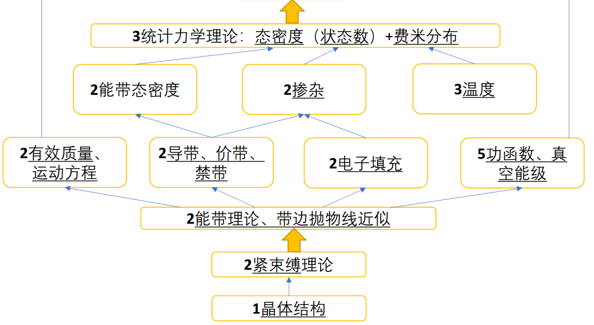

# 半导体物理

## 1.	晶体结构

### 基本概念

- 相对分子质量=摩尔质量=$g/mol$
- 阿伏伽德罗常数$N_A$
- 晶体=晶格$\times$晶胞
- 晶格$\rightarrow$正格矢{$\vec{a_1},\vec{a_2},\vec{a_3}$}$\rightarrow$矢量的长度（晶格常数）{$a,b,c$}、夹角{$\alpha,\beta,\gamma$}
- 晶面：
  - 米勒指数$(h,k,l)\rightarrow$对称性相同的晶面$\{h,k,l\}$
  - 米勒-布拉伐指数$(h,k,m,l)$
- 晶向：$[h,k,l]\rightarrow$对称性相同的晶向$<h,k,l>$
- 晶面间距：晶面和原点距离
- 晶面化学键密度：解理？？？
- 原子面终止：顶部和底部的原子
- 倒格矢：{$\vec{b_1},\vec{b_2},\vec{b_3}$},$\begin{cases}\vec{b_1}\cdot\vec{a_1}=2\pi\\\vec{b_1}\cdot\vec{a_2}=0\\\vec{b_1}\cdot\vec{a_3}=0\end{cases}$
- 布里渊区：倒格子矢量垂直平分线包络

### 具体晶体

|          |                              Si                              |                             GaN                              |
| :------: | :----------------------------------------------------------: | :----------------------------------------------------------: |
|   晶胞   |                            金刚石                            |                          六方纤锌矿                          |
|   晶格   |                             立方                             |                             六方                             |
| 晶格常数 |                        a=b=c=0.543 nm                        | a=b=0.319 nm,c=0.519 nm,$\alpha = \beta = 90^o , \gamma = 120^o$ |
|   原胞   |                             1+1                              |                             1+1                              |
| 原胞晶格 |                           面心立方                           |                          六方密堆积                          |
|   图片   |  |  |

| 常见晶体结构 |                            金刚石                            |                          立方闪锌矿                          |                          六方纤锌矿                          |
| :----------: | :----------------------------------------------------------: | :----------------------------------------------------------: | :----------------------------------------------------------: |
|     元素     |                           IV族单质                           |                         III-V、II-VI                         |                         III-V、II-VI                         |
|    化学键    |                             共价                             |                         偏共价弱极性                         |                         偏离子强极性                         |
|     图片     |  |  |  |
|   特殊性质   |                                                              |                                                              |                           压电效应                           |

### 测量

直接：STEM>TEM

间接：X射线衍射

波长$\lambda$，衍射峰$\theta$，晶面间距为$d$，有：
$$
2d\ sin\frac{\theta}{2}=\lambda
$$

## 2.	能带理论

### 自由电子

波函数：
$$
\text{波函数：}\psi=Ae^{i(k\cdot x-\omega t)}\\
\text{能量：}E=\hslash\omega\\
\text{动量：}p=\hslash k=m^*v_g\\
\text{色散关系（能带）：}E(k)=\hslash\omega=\frac{\hslash^2k^2}{2m}\\
\text{相速度：}v_p=\frac{\omega}{k}\\
\text{群速度（粒子的速度）：}v_g=\frac{\rm{d}\omega}{\rm{d}\mit k}\\
\text{粒子质量：}m^{*-1}=\frac{1}{\hslash^2}\dfrac{\partial^2E}{\partial k^2}\\
\text{不确定性：}\Delta x\Delta p\geqslant \frac{\hslash}{2}\rightarrow \Delta x\Delta k\geqslant \frac{1}{2}
$$

### 类氢原子电子

$$
V=\dfrac{-Ze^2}{4\pi\epsilon_0 r}\\
E=\hslash\omega=-\dfrac{mZ^2e^4}{32\pi^2\epsilon^2_0\hslash^2 n^2}=-13.6eV\cdot\dfrac{Z^2}{n^2}\\
n为主量子数，N为原子序数
$$

### 多原子电子

轨道重叠$\rightarrow$电子共有化$\rightarrow$波函数重组$\rightarrow$能级分裂$\rightarrow$展宽形成能带$\rightarrow$能带为允带，中间的“真空”区域为禁带$\rightarrow$禁带上为导带，下为价带

同族原子，原子序数越大，半径越大，重叠的波函数越多，展宽更大

同族原子，原子序数越大，半径越大，原子束缚电子能力减弱，所以有效质量更小

### 晶体电子

#### 一维氢晶体

原子间隔为a，原子数量为N，T是一个常数

##### 能带

$$
\begin{cases}
E(k)=E_{1s}-2Tcos(ka)\\
k=\dfrac{2m\pi}{Na}\\
m=-\frac{N}{2}+1,...,\frac{N}{2}
\end{cases}
$$
$$
\text{布里渊区大小：}k=\frac{2\pi}{a}\\
$$

##### 态密度（DOS）

$$
\begin{cases}
DOS&=\dfrac{dZ}{dE}=\dfrac{dZ}{dk}\dfrac{dk}{dE}=\dfrac{N}{4\pi Tsin(ka)}\text{(考虑自旋应当再乘2)}\\
\dfrac{dZ}{dk}&=\dfrac{1}{\Delta k}=\dfrac{Na}{2\pi}\\
\end{cases}
$$

##### 有效质量

将$E(k)=E_{1s}-2Tcos(ka)$在极值点泰勒展开：
$$
\begin{cases}
E(k-k_0)=\dfrac{\hslash^2}{2m^*}+E_c\\
E_c=const\\
\text{带底的电子：}m_n^*=\dfrac{\hslash^2}{2Ta^2}\\
\text{带顶的空穴：}m_p^*=\dfrac{\hslash^2}{2Ta^2}
\end{cases}\\
$$

#### 三维氢晶体

$$
\text{能带：}E(k)=\dfrac{\hslash^2\vec{k}^2}{2m^*}+E_c\\
\text{等能面：}|\vec{k}|=\dfrac{\sqrt{2m^*(E-E_C)}}{\hslash}
$$

$$
\begin{cases}
DOS=\dfrac{dZ}{dE}=\dfrac{dZ}{dV}\dfrac{dV}{dk}\dfrac{dk}{dE}\\
\dfrac{dZ}{dV}=2{(\dfrac{Na}{2\pi})}^2(考虑自旋)\\
\dfrac{dV}{dk}=4\pi kdk\\
\dfrac{dk}{dE}=\dfrac{m^*}{\hslash\sqrt{2m^*(E-Ec)}}
\end{cases}
$$

#### 各向异性粒子

$$
\text{有效质量：}[m^*]=\dfrac{\hslash}{d^2E/d\vec{k}^2}=
\begin{bmatrix}
m^*_x&0&0\\
0&m^*_y&0\\
0&0&m^*_z\\
\end{bmatrix}
$$

有效质量有各向异性，等能面是椭球面

计算DOS时：
$$
\begin{cases}
DOS=\dfrac{L^3m^*_d\sqrt{2m^*_d(E-E(\vec{k_0}))}}{\pi^2 \hslash^3}\quad\text{L：晶格常数}\\
\\m^*_d={(m^*_x m^*_y m^*_z)}^{1/3}\\
\end{cases}
$$

#### 硅晶体

##### 导带底电子

具有各向异性(不同方向有效质量不同)：
$$
\text{有效质量：}[m^*_n]=
\begin{bmatrix}
m^*_{nx}&0&0\\
0&m^*_{ny}&0\\
0&0&m^*_{nz}\\
\end{bmatrix}\\
m^*_{nx}=m_{nl}\text{(longitudinal纵向)}=0.92m\\
m^*_{ny}=m_{nt}\text{(transverse横向)}=0.19m\\
m^*_{nz}=m_{nt}=0.19m\\
\text{有效质量态密度：}m^*_{dn}={(s^2m^*_{nl}m^{*2}_{nt})}^{1/3}\\
\text{s由对称性引起：}s=6\\
\text{电子惯性质量：}m=m_e\\
DOS=\dfrac{L^3}{2\pi^3}\dfrac{{(2m^*_{dn})}^{3/2}}{\hslash^3}\sqrt{E-E_c}\\
\text{导带底能量：}E_c
$$

##### 价带顶空穴

具有三条能带(不同能带有效质量不同)：
$$
\begin{cases}
\text{重空穴带(HH)：}&m^*_{ph}=0.53m\\
\text{轻空穴带(LH)：}&m^*_{pl}=0.16m\\
\text{自旋-轨道耦合带(SC)：}&m^*_{p3}=0.25m\\
\end{cases}
$$

因为SO分裂能的存在，只有少部分空穴在SC带，因此忽略SC带，计算有效质量态密度：

$$
\text{有效质量态密度：}m^*_{dp}={(m^{*\ 3/2}_{ph}+m^{*\ 3/2}_{pl})}^{2/3}\\
DOS=\dfrac{L^3}{2\pi^3}\dfrac{{(2m^*_{dp})}^{3/2}}{\hslash^3}\sqrt{E_V-E}\\
\text{价带顶能量：}E_V
$$

#### 金刚石晶体、锗晶体

**原子半径增大**，原子轨道重叠变大，导带价带展宽变大，带隙变小

在相同位置下，有效质量变小

|        | $m^*_{nl}$ | $m^*_{nt}$ | $m^*_{ph}$ | $m^*_{pl}$ | $m^*_{p3}$ |
| :----: | :--------: | :--------: | :--------: | :--------: | :--------: |
| **Si** |  $0.92m$   |  $0.19m$   |  $0.53m$   |  $0.16m$   |  $0.245m$  |
| **Ge** |  $1.64m$   |  $0.08m$   |  $0.28m$   |  $0.044m$  |  $0.077m$  |

($m$：电子惯性质量)

#### 闪锌矿晶体、纤锌矿晶体

**离子键成分增大**，展宽变小，带隙变大，有效质量变大

#### 一般晶体

- 原子半径增大，共价键成分变大，原子轨道重叠变大，导带价带展宽变大，带隙变小
- 离子键成分增大，展宽变小，带隙变大，有效质量变大
- 价带顶在$\Gamma$点，有3条带：重空穴带、轻空穴带、自旋轨道耦合带，SO分裂能能随原子序数增大而增大
- 导带底不确定位置，只有1条带

### 能带测量

回旋共振：
$$
m^*=m^*_c=\dfrac{qB}{2\pi f_c}
$$
对于各向异性：
$$
\begin{cases}
\dfrac{1}{m^*_c}=\sqrt{\dfrac{m^*_tsin^2\theta+m^*_lcos^2\theta}{m^{*2}_tm^*_l}}\\
\text{磁场B与纵向l的夹角：}\theta
\end{cases}
$$
注意：纵向方向$l$的取值由于对称性可能不止一个方向，这导致$\theta$也可能存在多个取值，从而存在多个吸收峰

## 3.	电子统计

### 基本概念

#### **能级**

- 价带顶V：空穴导电的地方
- 导带底C：电子导电的地方
- 施主D(V族)：提供多余电子，电子激发（电离）到C导电
- 受主A(III族)：提供多余空穴，空穴激发（电离）到V导电

#### **半导体**

- 本征半导体：不参杂，只有C、V
- n型半导体：参杂施主D，有C、V、D
- p型半导体：参杂受主A，有C、V、A

#### **等效浓度**

载流子等效状态浓度

- 导带等效状态浓度$N_C$
- 价带等效状态浓度$N_V$

#### **参杂浓度**

杂质原子浓度

- 施主浓度$N_D$
- 受主浓度$N_A$

#### **载流子**

导电的粒子

- 价带顶的空穴
- 导带底的电子

#### 玻尔兹曼常数

- $k_B=1.38\times10^{-23}J/K$

- 室温（$T=300K$）下：$k_B\ T=26meV$

$$
E_V<E_A<E_D<E_C\\
\text{带隙：}E_g=E_C-E_V\\
\text{施主杂质电离能：}\Delta E_D=E_C-E_D\\
\text{受主杂质电离能：}\Delta E_A=E_A-E_V\\
$$

### 本征半导体

#### 统计分布

##### 费米分布

$$
f_F(E)=\dfrac{1}{e^{\dfrac{E-E_F}{k_BT}}+1}
$$

##### 玻尔兹曼分布

在$E>>E_F(E-E_F>2.5k_BT)$或$E<<E_F(E-E_F<-2.5k_BT)$的情况下，费米分布非简并为（约等于）玻尔兹曼分布
$$
E>>E_F\text{(导带底)}:
\begin{cases}
f_C(E)=f_B(E)=A\exp\left(-\dfrac{E}{k_0T}\right)\\
A=\exp\left(\dfrac{E_F}{k_0T}\right)
\end{cases}\\
E<<E_F\text{(价带顶)}:
\begin{cases}
f_V(E)=1-f_B(E)=B\exp\left(\dfrac{E}{k_0T}\right)\\
B=\exp\left(-\dfrac{E_F}{k_0T}\right)
\end{cases}
$$

==形如$n=N\exp\left(-\dfrac{\Delta E}{k_BT}\right)\\$形式的，$\Delta E$越小，$N$转化(电离)为$n$的概率越大！！！==

#### 态密度

$$
\text{导带底电子}:g_C(E)=\dfrac{L^3}{2\pi^3}\dfrac{{(2m^*_{dn})}^{3/2}}{\hslash^3}\sqrt{E-E_c}\\
\text{价带顶空穴}:g_V(E)=\dfrac{L^3}{2\pi^3}\dfrac{{(2m^*_{dp})}^{3/2}}{\hslash^3}\sqrt{E_V-E}\\
$$

#### 载流子浓度

$$
\text{导带底电子}:n=\dfrac{1}{L^3}\int g_C(E)f_C(E)dE\\
\text{价带顶空穴}:p=\dfrac{1}{L^3}\int g_V(E)f_V(E)dE\\
$$

$$
\text{导带底}:
\begin{cases}
n=N_C\exp\left(-\dfrac{E_C-E_F}{k_BT}\right)\\
N_C=2\dfrac{{(m^*_nk_BT/2\pi)}^{3/2}}{\hslash^3}
\end{cases}\\
\text{价带顶}:
\begin{cases}
p=N_V\exp\left(-\dfrac{E_F-E_V}{k_BT}\right)\\
N_V=2\dfrac{{(m^*_pk_BT/2\pi)}^{3/2}}{\hslash^3}
\end{cases}
$$

在本征半导体里面有：$n_0=p_0$

定义本征载流子浓度$n_i^2={(n_0p_0)}^{1/2}=n_0=p_0$

==**则$n_i$在温度一定的情况下与$E_F$无关，而且杂质半导体在各种温度下也适用以下关系！！！**==：
$$
n_i^2=n_0p_0=N_CN_V\exp\left(-\dfrac{E_g}{k_BT}\right)
$$
本征费米能级$E_i$：当$n_0=p_0$求出的费米能级
$$
E_i=\frac{1}{2}(E_C+E_V-k_BT\ln\frac{N_C}{N_V})
$$

### 掺杂半导体

#### 统计分布

能带中与本征半导体相同，但是掺杂的能级有所不同：
$$
\text{施主能级：}\begin{cases}
f_D(E_D)=\dfrac{1}{\dfrac{1}{g_D}\exp{(\dfrac{E_D-E_F}{k_BT})}+1}\\
\text{导带的简并度（包含自旋）：}g_D=2
\end{cases}\\
\text{受主能级：}\begin{cases}
1-f_A(E_A)=\dfrac{1}{\dfrac{1}{g_A}\exp{(\dfrac{E_F-E_A}{k_BT})}+1}\\
\text{价带的简并度（包含自旋）：}g_A=4
\end{cases}\\
$$

非简并条件下转为玻尔兹曼分布：
$$
n=N_D\ f_D(E_D)=N_Dg_D\exp\left(-\dfrac{E_D-E_F}{k_BT}\right)\\
p=N_A\ (1-f_A(E_A))=N_Ag_A\exp\left(-\dfrac{E_F-E_A}{k_BT}\right)\\
$$

#### 电中性条件

$$
\begin{cases}
N_D&=n_D(未电离)+n_D^+(已电离的正电原子和电子对数量)\\[1ex]
n_D&=N_Df_D(E_D)\\[1ex]
N_A&=p_A(未电离)+p_A^-(已电离的负电原子和空穴对数量)\\[1ex]
p_A&=N_A(1-f_A(E_A))\\
\end{cases}
$$

所以有：
$$
n(电子)+p_A^-(负电原子)=p(空穴)+n_D^+(正电原子)
$$

#### 温度区

温度由低到高，根据不同条件可以化简条件得到：

##### 低温弱电离区

特点：本征激发=0，杂质电离很小

结论：
$$
n:\begin{cases}
p_0=0\\[1ex]
n_0=n_D^+\\[1ex]
E_F=\dfrac{E_C+E_D}{2}+\dfrac{k_BT}{2}\ln\left(\dfrac{N_D}{2N_C}\right)\\
n_0=\sqrt{\dfrac{N_DN_C}{2}}\exp\left(-\dfrac{\Delta E_D}{2k_BT}\right)\\
\end{cases}\\
p:\begin{cases}
n_0=0\\[1ex]
p_0=p_A^-\\[1ex]
E_F=\dfrac{E_V+E_A}{2}-\dfrac{k_BT}{2}\ln\left(\dfrac{N_A}{4N_V}\right)\\
p_0=\sqrt{\dfrac{N_AN_V}{4}}\exp\left(-\dfrac{\Delta E_A}{2k_BT}\right)\\
\end{cases}
$$

##### 中间电离区

$E_F$逐渐向中间能级靠拢，直到越过$E_D(E_A)$

##### 强电离区（饱和区）

特点：本征激发=0，杂质电离完全$(>90\%)$

结论：
$$
n:\begin{cases}
p_0=0\\[1ex]
n_0=N_D\\[1ex]
E_F=E_C+\dfrac{k_BT}{2}\ln\left(\dfrac{N_D}{N_C}\right)\\
\text{未电离的施主原子比例：}D^-=\dfrac{n_D}{N_D}=2\dfrac{N_D}{N_C}\exp\left(\dfrac{\Delta E_D}{k_BT}\right)\\
\end{cases}\\
p:\begin{cases}
n_0=0\\[1ex]
p_0=N_A\\[1ex]
E_F=E_V-\dfrac{k_BT}{2}\ln\left(\dfrac{N_A}{N_V}\right)\\
\text{未电离的受主原子比例：}D^+=\dfrac{p_A}{N_A}=4\dfrac{N_A}{N_V}\exp\left(\dfrac{\Delta E_A}{k_BT}\right)\\
\end{cases}
$$

##### 过渡区

特点：本征激发开始起作用，和杂质电离不相上下

结论：
$$
n:\begin{cases}
E_F=E_i+k_BT\ arcsh\left(\dfrac{N_D}{2N_i}\right)\\
n_0=\dfrac{N_D}{2}\left[1+{\left(1+\dfrac{4n_i^2}{N_D^2}\right)}^{1/2}\right]\\
p_0=\dfrac{n_i^2}{n_0}
\end{cases}\\
p:\begin{cases}
E_F=E_i-k_BT\ arcsh\left(\dfrac{N_A}{2N_i}\right)\\
p_0=\dfrac{N_A}{2}\left[1+{\left(1+\dfrac{4n_i^2}{N_A^2}\right)}^{1/2}\right]\\
n_0=\dfrac{n_i^2}{p_0}
\end{cases}
$$

##### 高温本征激发区

特点：高温，本征激发起主要作用，杂质电离忽略

结论：同本征半导体

##### 判断方法

1. 看温度，计算$N_C$或$N_V$，比较和杂质浓度$N_D$或$N_A$的大小
   1. 本征>>激发：本征激发区
   2. 本征==激发：过渡区
   3. 本征<<激发：进入2
2. 计算$4\dfrac{g_DN_D}{N_C}\exp\left(\dfrac{\Delta E_D}{k_BT}\right)$或$4\dfrac{g_AN_A}{N_V}\exp\left(\dfrac{\Delta E_A}{k_BT}\right)$，比较未激发的杂质比例
   1. $<<1$：强电离区
   2. $>>1$：弱电离区
   3. $\approx 1$：中间区

###  载流子浓度测量

霍尔效应

单位换算：$1\ T=10000\ Oe$
$$
\begin{cases}
n=\dfrac{JB}{Eq}\\
J=\dfrac{I}{S}\\
E=\dfrac{U}{d}\\
\end{cases}
$$

## 4.	输运现象

### 基本概念

- 电阻R，单位$\Omega$(Ohm)
- 电导G，单位S
- 电阻率$\rho$
- 电导率$\sigma$
- 载流子迁移率$\mu$

关系：
$$
R=\rho\frac{l}{S}\\
RG=\rho\sigma=1\\
j=\sigma E=nqv_dE\\
\sigma=nq\mu\\
\text{对于多种载流子导电有：}\sigma=\Sigma n_iq_i\mu_i\\
\text{对于半导体导电有：}\sigma=ne\mu_n+pe\mu_p
$$

### 散射

载流子运动速度存在平衡：

成因：周期性势场被破坏

#### 基本概念

- 散射几率P：单位时间受到散射次数
- 平均自由时间$\tau$：两次散射平均中间时间
- 速度$v_d$：电子在外场作用下的平均速度（把热运动平均掉的速度）
- 平均自由程$\lambda$：两次散射平均中间路程

关系：
$$
P=\dfrac{1}{\tau}\\
\text{多种散射发生时的总散射：}P=\Sigma P_i\\
\lambda=v_d\ \tau\\
\mu=\dfrac{q\tau}{m^*}\\
\text{对于各向异性的硅导带底：}m^*_n=m^*_{cn}\\
\text{电子的电导有效质量：}m^{*-1}_{cn}=\dfrac{2m^{*-1}_t+m^{*-1}_l}{3}\\
\text{对于多条能带的硅价带顶：}m^*_p=m^*_{cp}\\
\text{空穴的电导有效质量：}m_{cp}^*=\dfrac{{(m^*_{pl})}^{3/2}+{(m^*_{ph})}^{3/2}}{{(m^*_{pl})}^{1/2}+{(m^*_{ph})}^{1/2}}
$$

#### 分类

##### 电离杂质散射

条件：低温时主导

结论：
$$
P_i\propto N_iT^{-3/2}\\
\text{杂质浓度：}N_i=N_D+N_A
$$

##### 声子散射

低能长波声子容易散射电子

分为6支，6=2（声学波、光学波）$\times$3（2（横波）+1（纵波））

横波影响小，不考虑

纵波分为纵光学波、纵声学波

###### 纵声学声子

条件：高温时主导

结论：
$$
P_a=\propto T^{3/2}
$$

###### 纵光学声子

条件：极性半导体

结论：
$$
P_o\propto \dfrac{1}{\exp\left(\dfrac{\hslash\omega_0}{k_BT}\right)-1}\\
\text{声子频率：}\omega_0
$$

##### 其它散射

中性杂质散射、电子（空穴）散射、晶格缺陷散射、表面散射、能谷间散射等等

#### 温度与杂质的影响

对于非极性半导体：
$$
P(N_i,T)=\Sigma P=P_i+P_a=AN_iT^{-3/2}+BT^{3/2}
$$
所以迁移率$\mu=\dfrac{q\tau}{m^*}=\dfrac{q}{Pm^*}$来说，在$m^*$一定的情况下，迁移率$\mu=\mu(N_i,T)$

温度有：低温下，电离杂质散射占主要地位；高温下，声学支声子散射占主要地位

存在一个极值(几十K左右)

所以室温(300 K)下，以声子散射为主，除非重掺杂$(1\times10^{17}cm^{-3})$

杂质有：$N_i$越高，极值越低

### 电阻与温度

讨论掺杂半导体电阻和温度、掺杂浓度关系：

$$
\sigma(T,N_i)=n_i(T,N_i)\mu_i(T,N_i)e
$$

温度有：

杂质浓度有：

结论：在室温(300 K)下，**掺杂**(浓度$<1\times10^{17}cm^{-3}$)下的半导体，处于强电离区、声子散射，有：
$$
\rho\propto \dfrac{1}{N_D}\quad or \quad \rho\propto\dfrac{1}{N_A}
$$
而**本征**半导体有：
$$
\rho\propto\exp\left(\dfrac{E_g}{2k_BT}\right)
$$

### 测量

迁移率可以通过电阻率和载流子浓度间接算出

## 5.	非平衡载流子

### 产生原因

光、电、辐射“注入”载流子，以下讨论“光注入”

光子注入形成一对电子空穴，从而产生了多的载流子$\Delta n=\Delta p$

假设处于“小注入”状态$\Delta n,\Delta p<<n_0,p_0$

### 判据

平衡态有：
$$
n_0p_0=n_i^2
$$
非平衡态有：
$$
np=(n_0+\Delta n)(p_0+\Delta p)>n_i^2
$$

### 统计分布

费米能级$E_F$$\rightarrow$载流子分布$f(E)$$\rightarrow$载流子浓度$n_0$

当载流子浓度被注入时，我们也能反过来定义相应的准费米能级$E_{Fn},E_{Fp}$
$$
\text{导带：}f_n(E)=\dfrac{1}{\exp\left(\dfrac{E-E_{Fn}}{k_BT}\right)+1}\\
\text{价带：}f_p(E)=\dfrac{1}{\exp\left(\dfrac{E-E_{Fp}}{k_BT}\right)+1}\\
$$

由于非平衡态$n,p$均增加，因此$E_F$一份为二，其中$E_{Fn}$更靠近$E_C$，$E_{Fp}$更靠近$E_V$

修正后的载流子有：
$$
\text{导带底}:
\begin{cases}
n=N_C\exp\left(-\dfrac{E_C-E_{Fn}}{k_BT}\right)\\
N_C=2\dfrac{{(m^*_nk_BT/2\pi)}^{3/2}}{\hslash^3}
\end{cases}\\
\text{价带顶}:
\begin{cases}
p=N_V\exp\left(-\dfrac{E_{Fp}-E_V}{k_BT}\right)\\
N_V=2\dfrac{{(m^*_pk_BT/2\pi)}^{3/2}}{\hslash^3}
\end{cases}\\
np=n_i^2\exp\left(-\dfrac{E_{Fn}-E_{Fp}}{k_BT}\right)
$$

### 产生和复合

非平衡载流子浓度时域上产生和消失满足指数律：

$\text{平均存活时间：}\tau_{in}$

存活时间由产生率G和复合率R决定
$$
G-R=\frac{\rm d}{\rm dt}\Delta n
$$

#### 本征半导体

只有价带和导带，所以只存在直接产生和直接复合

$r_{id}$为直接复合系数，本征产生率与温度有关，光生产生率和能流密度$S$、吸光度$\alpha$、量子效率$\eta$等有关
$$
\text{本征产生率：}G_{eq}=r_{id}n_i^2\\
\text{光生产生率：}G_{pc}=\dfrac{\alpha\eta S}{D\hslash\omega}\\
\text{复合率：}R=r_{id}np\\
\text{平均存活时间：}\tau_{in}=\dfrac{1}{2r_{id}n_i}
$$

#### 掺杂半导体

##### 只考虑直接产生和直接复合

$$
\text{平均存活时间：}\tau_{in}=\dfrac{1}{r_{id}(n_0+p_0)}
$$

##### 如果考虑间接产生和间接复合

$$
\large\begin{cases}
R_1=r_nn(N_t-n_t)\\
R_2=r_ppn_t\\
G_1=s_p(N_t-n_t)\\
G_2=s_nn_t\\
G_1+R_1=G_2+R_2\\
\end{cases}
$$
$r_n,r_p,s_n,s_p$为系数(r：俘获系数，S：激发概率，n：电子，p：空穴)，$n_t$为复合中心上的电子浓度，$N_t$为复合中心浓度

于是求出来
$$
n_t=n_t(n_0,p_0,n_1,p_1)=...\\
\tau_{in}=\tau_{in}(n_0,p_0,n_1,p_1)=...\\
n_0=N_C\exp\left(-\dfrac{E_C-E_F}{k_BT}\right)\\
n_1=N_C\exp\left(-\dfrac{E_C-E_t}{k_BT}\right)\\
p_0=N_V\exp\left(-\dfrac{E_F-E_V}{k_BT}\right)\\
p_1=N_V\exp\left(-\dfrac{E_t-E_V}{k_BT}\right)\\
$$
$E_F$：n型或p型掺杂的费米能级，$E_t$：复合中心掺杂的费米能级（复合中心可以由深能级杂质担任，也可以由其它杂质担任）

对应的能级差越小，所对应的粒子浓度就越高

我们分类讨论：

|   名称   |          强p型区           |                p型高阻区                 |                n型高阻区                 |          强n型区           |
| :------: | :------------------------: | :--------------------------------------: | :--------------------------------------: | :------------------------: |
|   条件   |       $E_F-E_V$最小        |              $E_C-E_t$最小               |              $E_t-E_V$最小               |       $E_C-E_F$最小        |
| 最大粒子 |           $p_0$            |                  $n_1$                   |                  $p_1$                   |           $n_0$            |
| 存活时间 | $\tau_p=\dfrac{1}{N_tr_n}$ | $\tau_{hr}=\dfrac{n_1}{N_tr_p(n_0+p_0)}$ | $\tau_{hr}=\dfrac{p_1}{N_tr_n(n_0+p_0)}$ | $\tau_n=\dfrac{1}{N_tr_p}$ |
|          |                            |                                          |                                          |                            |

##### 综合直接和间接

$$
\large G_{total}=G_{直接}+G_{间接}\\
\large r_{total}=r_{直接}+r_{间接}\\
\large \tau^{-1}_{total}=\tau^{-1}_{直接}+\tau^{-1}_{间接}\\
$$

#### 其它产生和复合

- 表面复合：表面态起到复合中心的作用
- 俄歇（Auger）复合：将能量传给载流子而非声子或光子的过程
- 陷阱态：载流子占据后无法复合

### 扩散

空间上的分布不均导致载流子扩散：
$$
\text{菲克第二定律：}\dfrac{\partial n}{\partial t}+R-G=D\nabla^2n\\
\text{扩散电流：}j=\mp qD\nabla n\\
\text{稳态有：}\begin{cases}
\dfrac{\Delta n}{\tau_{in}}=D\nabla^2(\Delta n)\\
\dfrac{\partial n}{\partial t}=0
\end{cases}\\
D是常数
$$

一维扩散有：
$$
j_x=\dfrac{qD}{L}(\Delta p)_0e^{-x/L}\\
\text{扩散长度：}L=\sqrt{D\tau_{in}}\\
$$
平衡态有：
$$
j_{total}=nq\mu_nE+qD_n\nabla n=0\\
\text{得到爱因斯坦关系：}\mu_n=\dfrac{qD_n}{k_BT}\\
\text{做题常用：}j_{total}=-pq\mu_p\nabla V-nq\mu_n\nabla V-\mu_pk_BT\nabla p+\mu_nk_BT\nabla n=0\\
j_{total}=p\mu_p\nabla E_{Fp}+n\mu_n\nabla E_{Fn}
$$

做题常用：
$$
\begin{cases}
j_{total}=-pq\mu_p\nabla V-nq\mu_n\nabla V-\mu_pk_BT\nabla p+\mu_nk_BT\nabla n=0\\
\nabla^2 V=-\dfrac{\rho}{\epsilon}=q\dfrac{\Delta n}{\epsilon}\\
\end{cases}
$$

### 测量

Haynes-Shockley实验

# 半导体器件

## 6.	PN结

### 形成

说法1：P型半导体和N型半导体贴在一起，P中多子为空穴往N型半导体扩散，N中多子为电子往P型扩散，P型半导体中有更多$p^-$，N型半导体有更多$n^+$，这产生了静电荷，形成内建电场

说法2：PN半导体中的费米能级$E_F$不同，贴在一起时为了保持$E_F$在热平衡状态下为常数，能带扭曲，P型半导体能量上升，N型半导体能量下降，差值为内建电场

### 零偏

#### 电压

$$
\text{内建电压：}V_{bi}=U_T\ln\left(\dfrac{N_aN_d}{n_i^2}\right)\\
\text{热电压：}U_T=\dfrac{kT}{q}
$$

#### 电场

假设电荷扩散均匀分布（零次分布），则电场$E=\int\rho(x)dx$呈一次分布，电势$\phi=\int E(x)dx$呈二次分布：

$$
N_ax_p=N_dx_n\\
E(0)=E_{max}=\dfrac{-e}{\epsilon_s}\cdot N_ax_p=\dfrac{-2V_{bi}}{W}\\
\phi(x)=\begin{cases}
\dfrac{eN_a}{2\epsilon_s}(x+x_p)^2,&-x_p\leqslant x\leqslant 0\\
\dfrac{eN_d}{\epsilon_s}\left(x_n\cdot x-\dfrac{x^2}{2}\right)+\dfrac{eN_a}{2\epsilon_s}x_p^2,&0\leqslant x\leqslant x_n
\end{cases}\\
x_n=\sqrt{\dfrac{2\epsilon_sV_{bi}}{e}\dfrac{N_a}{N_d}\dfrac{1}{N_a+N_d}}\\
x_p=\sqrt{\dfrac{2\epsilon_sV_{bi}}{e}\dfrac{N_d}{N_a}\dfrac{1}{N_a+N_d}}\\
W=x_n+x_p=\sqrt{\dfrac{2\epsilon_sV_{bi}}{e}\dfrac{N_a+N_d}{N_aN_d}}
$$

### 反偏

加从n到p的正电压$V_R$，对电子来说n的费米能级降低，p的费米能级升高

电势差增大，结论与零偏相同，将 $V_{bi}$ 换成 $V_{total}=V_{bi}+V_R$ 即可
$$
W=\sqrt{\dfrac{2\epsilon_sV_{total}}{e}\dfrac{N_a+N_d}{N_aN_d}}\\
E_{max}=\dfrac{-2V_{total}}{W}\\
\text{结电容：}C'=\dfrac{\epsilon_s}{W}
$$

#### 单边结

若一段重掺杂而一段轻掺杂，则称该节为单边结，在$N_a>>N_d$时，该节为 $p^+n$ 结，有$N_a+N_d\approx N_a$，有：
$$
W=\sqrt{\dfrac{2\epsilon_sV_{total}}{eN_d}}=x_n\\
C'=\dfrac{\epsilon_s}{W}
$$

#### 结击穿

$$
\text{反向击穿电压：}V_B=\dfrac{\epsilon_sE_{max}^2}{2eN_B}\\
N_B\text{为低掺杂的掺杂浓度}\\

$$r