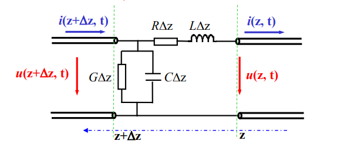

# Ch8	集粹

## 一、均匀传输线

$$
\begin{cases}
\gamma^2=(R+j\omega L)(G+j\omega C)\\
\dfrac{d^2U(z)}{dz^2}-\gamma^2U(z)=0\\
\dfrac{d^2U(z)}{dz^2}-\gamma^2U(z)=0\\
\end{cases}
$$
解为：
$$
Z_0=\sqrt{\dfrac{R+j\omega L}{G+j\omega C}}\xlongequal{无耗}\sqrt{\dfrac{L}{C}}\\
U(z)=A_1e^{+\gamma z}+A_2e^{-\gamma z}\\
U(z)=U_+(z)+U_-(z)\\
I(z)=\dfrac{1}{Z_0}[U_+(z)-U_-(z)]\\
\text{特性阻抗：}Z_0=\dfrac{U_+(z)}{I_+(z)}=-\dfrac{U_-(z)}{I_-(z)}
$$
物理意义：
$$
\gamma=\sqrt{(R+j\omega L)(G+j\omega C)}\\
\gamma=a+j\beta\\
\text{无耗：}\alpha=0,\beta=\omega\sqrt{LC}\\
$$
带了负载$Z_L$之后：
$$
\text{终端反射系数：}\Gamma_L=\dfrac{Z_L-Z_0}{Z_L+Z_0},\text{负载阻抗：}Z_L\\
\Gamma(z)=\Gamma_Le^{-j2\beta z}\\
Z_{in}(z)=Z_0\dfrac{1+\Gamma(z)}{1-\Gamma(z)}\\
\text{电压驻波比：}\rho=\dfrac{1+|\Gamma_L|}{1-|\Gamma_L|}
$$
