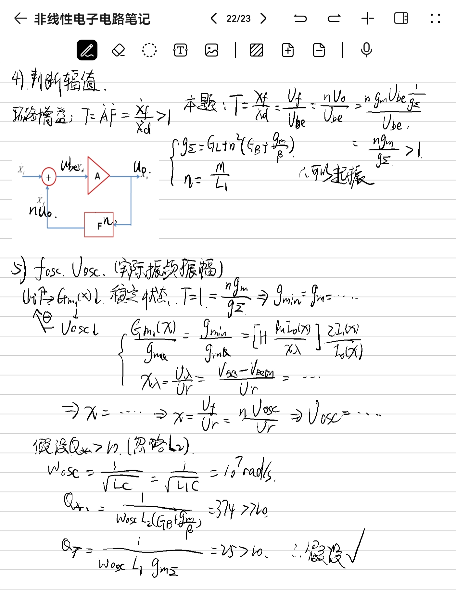

# 非线性电子电路

## 1.	基本方法

### 数学公式

$$
\cos \alpha\cos \beta=\frac{1}{2}[\cos(\alpha+\beta)+\cos(\alpha-\beta)]\\
\cos ^3\alpha=\frac{1}{4}[3\cos\alpha+\cos 3\alpha]\\
\text{电流：}i=I_m\cos\omega t\\
\text{有效值：}I=\frac{1}{\sqrt2}I_m\\
\text{平均值：}\overline I=\dfrac{I_m}{\pi}
$$

### 基本表示

$\text{字符}_\text{下标}$

- $U_{BE}$：直流压降
- $U_{be}$：交流电压幅度
- $u_{BE}$：压降瞬时值
- $u_{be}$：交流压降

#### 静态电导	$G$

$$
G\text{(静态电导)}=\dfrac{I_Q\text{(静态工作点电流)}}{U_Q\text{(静态工作点电压)}}
$$

#### 动态电导	$g$

$$
g\text{(动态电导)}=\dfrac{\partial i}{\partial u}|_{u=U_Q}
$$

#### 基波等效电导	$G_{m1}$

$$
\begin{cases}
\text{输入电压：}u=U_Q+U_1\cos \omega t\\
\text{响应电流：}I=I_0+I_1\cos \omega t+I_2\cos 2\omega t+...+I_n\cos n\omega t\\
\text{基波等效电导：}G_{m1}=\dfrac{I_1}{U_1}
\end{cases}
$$

### 非线性器件

二极管、三极管、MOS管等等

其中变容二极管有：
$$
C_j=C_{j0}\left(1+\frac{u}{U_\phi}\right)^{-\gamma}
$$

### 选频网络

$$
\text{固有谐振频率：}\omega_0=\dfrac{1}{\sqrt{LC}}\\
f_0=\dfrac{1}{2\pi\sqrt{ LC}}\\
\text{带宽：}BW=\dfrac{1}{RC}\\
\text{回路品质因数：}Q=\omega_0RC\\
\text{谐波失真：}THD=\dfrac{D(x)}{Q}
$$

### 指数律

二极管有：
$$
\begin{cases}
i=I_S[\exp(\dfrac{u}{U_r})-1]\approx I_S\exp(\dfrac{u}{U_r})\\
U_r=26mV\text{(室温)}
\end{cases}
$$
三极管有：
$$
I_E=I_{ES}\exp(\dfrac{u_{be}}{U_r})
$$

电流：
$$
\text{输入：}&u_{BE}(U_{BE},U_{be},\omega)=U_{BE}+U_{be}\cos \omega t\\
\text{输出：}&i_E(I_{E0},I_{E1})=I_{E0}+I_{E1}\cos\omega t+...\\
\text{函数：}&I_{E0}=I_{EP}\dfrac{I_0(x)}{\exp(x)}\\
&I_{E1}=I_{EP}\dfrac{2I_1(x)}{\exp(x)}\\
&I_{EP}=I_{ES}\exp(\dfrac{U_{BE}}{U_r})\exp(x)\\
&x=\dfrac{U_{be}}{U_r}
$$
跨导：
$$
\text{输入：}&I_{E0}\text{或者}g_{mQ}\\
\text{输出：}&G_{m1}(x)=\dfrac{I_{C1}}{U_{be}}\\
\text{函数：}&G_{m1}(x)=g_{mQ}\dfrac{2I_1(x)}{xI_0(x)}\\
&G_{m1}(x)=g_{mQ}[1+\dfrac{\ln I_0(x)}{x_\lambda}]\dfrac{2I_1(x)}{xI_0(x)}\\
&g_{mQ}=\dfrac{\alpha I_{E0}}{U_r}\\
&x=\dfrac{U_{be}}{U_r}\\
&x_\lambda=\dfrac{U_\lambda}{U_r}=\dfrac{V_{BB}-0.7}{U_r}
$$

总输出：
$$
u_o=G_{m1}(x)Ru_i
$$

### 折线律

大信号时，二极管和三极管的指数律特性退化为折线律特性

$$
\text{输入：}&u_i(U_Q,U_1)=U_Q+U_1\cos \omega t\\
\text{输出：}&G_{m1}(\varphi)=\dfrac{I_{1}}{U_{1}}\\
\text{函数：}&G_{m1}(\varphi)=\dfrac{I_P\alpha_1(\varphi)}{U_1}\\
&U_Q+U_1\cos\varphi=U_T
$$

### 双曲律

在差分指数率结构里面，有双曲律关系：

$$
\text{输入：}&\Delta u(U_1)=u_1-u_2=U_1\cos \omega t\\
\text{输出：}&G_{m1}(x)\\
\text{函数：}&G_{m1}(x)=g_{mdQ}\dfrac{4a_1(x)}{x}\\
&g_{mdQ}=\dfrac{\alpha I_K}{4U_r}\\
&x=\dfrac{\Delta u}{U_r}
$$
当$x>4$时，可以把它视作开关

### 平方律

FET有：
$$
\begin{cases}
I_{DSS}(1-\dfrac{u_{GS}}{U_P})^2\quad,U_P<u_{GS}<0\\
\\
0\quad,u_{GS}<U_P
\end{cases}
$$
通角工作状态：

$$
\text{输入：}&u_i(U_Q,U_1)=U_Q+U_1\cos \omega t\\
\text{输出：}&G_{m1}(\varphi)=\dfrac{I_{D1}}{U_{1}}\\
\text{函数：}&G_{m1}(\varphi)=\dfrac{I_{DP}\alpha_1(\varphi)}{U_1}\\
&I_{DP}=i_D|_{u_{GSmax}}\\
&U_Q+U_1\cos\varphi=U_P
$$

$$
u_{GS}=-U_1+U_1\cos\omega t
$$

### 时变参量

$U_Q,U_1>>U_2$，$U_Q,U_1$大信号（非线性响应），$U_2$小信号（线性响应）

先计算大信号的响应$i$，然后：
$$
u=(U_Q+U_1\cos\omega_1 t)+u_2(t)=U_Q(\omega_1t)+u_2(t)\\
i=I_Q(\omega_1t)+g(\omega_1t)u_2(t)\\
g=\dfrac{\partial i}{\partial u}|_{u=U_Q(\omega_1t)}
$$

## 2.	功率放大器

### 基本概念

放大器分类：（$\theta$为导通角）

甲类最大效率50%

乙类最大效率78.5%

效率：
$$
\eta=\dfrac{P_o}{P_{DC}}\\
\text{输出信号功率：}P_o\\
\text{电源提供的功率：}P_{DC}=V_{CC}I_{CQ}
$$

### 甲类

$$
\text{静态工作点：}(V_{CC},I_{CQ})\\
\text{不失真电阻：}R_L=\dfrac{V_{CC}}{I_{CQ}}\\
\text{用电流算功率：}P_o=\frac{1}{2}I_{CQ}^2R_L...(R<R_L)\\
\text{用电压算功率：}P_o=\frac{1}{2}\dfrac{V_{CC}^2}{R_L}...(R>R_L)\\
直流电流：\overline I=\dfrac{I_{CQ}}{\pi}
$$

### 乙类

外面的一堆电路不用管

??????????

### 丙类

$$
u_i=U_b\cos\omega t\\
\text{输入：}u_{BE}=-E_B+U_b\cos\omega t\\
\text{输出：}u_{CE}=V_{CC}-U_C\cos\omega t\\
$$
输出特性：

$$
N:u_{CE}|_{\omega t=\varphi}=0\\
\text{斜率：}-g_m\dfrac{U_b}{U_c}\\
求出M纵坐标
$$
转移特性：

$$
N':(U_T,0)\\
\text{斜率：}g_m\\
M'纵坐标=M纵坐标
$$
三种状态：

- 欠压：不进饱和
- 临界：最大在M点
- 过压：进饱和

### 丁类戊类

T1,T2作为饱和区的开关使用

### 馈电电路

放大器的直流偏置电路

#### 集电极馈电

串馈：电源、负载回路、功放管形式上串联

并馈：电源、负载回路、功放管形式上并联（推荐）

#### 基极馈电

并馈：基极偏压、信号输入回路、功放管并联（推荐）

串馈：基极偏压、信号输入回路、功放管串联

### 匹配网络

#### 串并转换

$$
\begin{cases}
R_P=R_S(1+Q^2)=R_SQ^2\\
\\
X_P=X_S(1+Q^{-2})=X_S
\end{cases}
\quad
\begin{cases}
R_S=\dfrac{R_P}{1+Q^2}=R_PQ^{-2}\\
X_S=\dfrac{X_P}{1+Q^{-2}}=X_P
\end{cases}
$$
谐振条件：

串联：$\Sigma X=0$

并联：$\Sigma\frac{1}{X}=0$

匹配条件：

$R_e'=R_L'$

#### 阻抗变换

n：阻抗系数

$$
\text{阻抗：}G'=n^2G\\
\text{电容：}C'=n^2C\\
\text{电感：}L'=\frac{1}{n^2}L\\
\text{电流源：}i'=ni\\
\text{电压源：}u'=\frac{1}{n}u\\
$$

部分接入实现阻抗变换：

$\large n=\dfrac{U_2}{U_1}=\dfrac{\frac{1}{j\omega C_2}}{\frac{1}{j\omega C_2}+\frac{1}{j\omega C_1}}$

其它类似

## 3.	正弦振荡器

### 分析思路

### 相位判断

- 瞬时极性法：共射反向放大；共基、共集同向
- 射同基反：X1，X2同容性或同感性；X2，X3相反性质

### 改进振荡器

Clapp:C=C3

Siller:C=C3+C4

### 石英振荡器

三种用法：

- 并联型：当作电感用
- 串联型：当作开关用，$\omega=\omega_s$小电阻，接在环路任一 处或放大器的偏置电阻旁代替高频旁路电容
- 泛音型：
