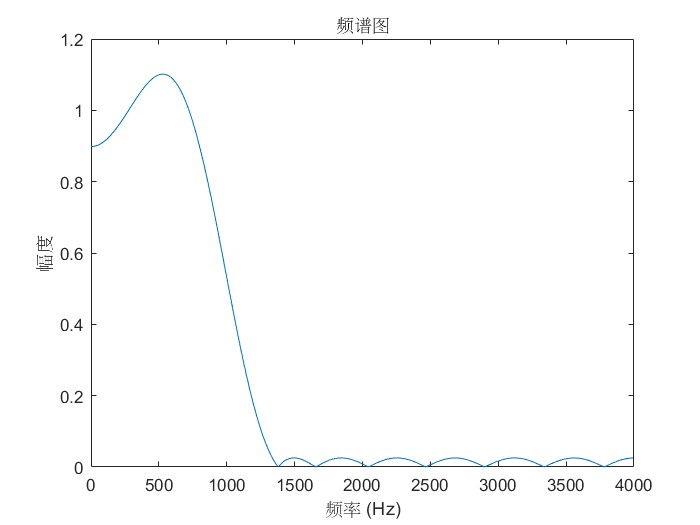
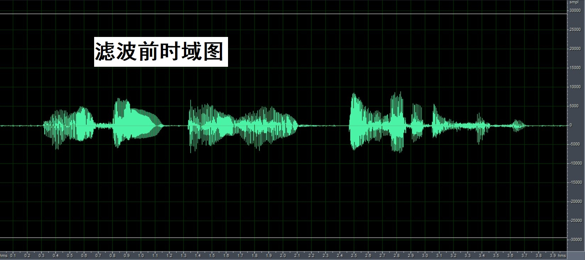
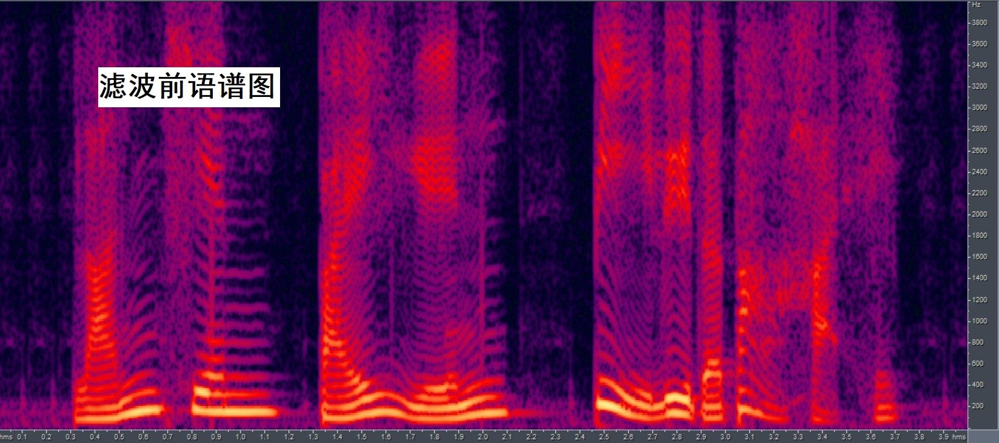

# 数字信号处理B

**PB21511897	李霄奕**

## BHW_1

### 实验目的

1. 掌握语音信号的按帧读取、写入方法
2. 对语音信号定点化，加快处理速度
3. 掌握运用特定滤波器对语音信号进行处理的方法

### 实验原理

语音信号以wav格式存储时，前44字节为头文件，之后的部分为语音信号本身

我们将语音信号主体以浮点类型读取，范围在-1到1之间，而计算机的浮点运算开销远大于定点运算，为了节省性能，我们需要将浮点的数据乘以$2^{15}=32768$，将数据转化为short（占2Byte=16bit）的定点整数类型进行运算。

存在一个19点有限相应的FIR低通滤波器，其9点系数为：

```matlab
h=[0.01218354,-0.009012882, -0.02881839, -0.04743239, -0.04584568,-0.008692503,0.06446265, 0.1544655, 0.2289794, 0.257883, 0.2289794, 0.1544655, 0.06446265, -0.008692503, -0.04584568,-0.04743239, -0.02881839, -0.009012882, 0.01218354]
```

滤波器的冲激响应$h(n)$与信号$x(n)$的结果$y(n)$满足：

$$
y(n)=h(n)*x(n)=\sum_{k=-\infty}^{\infty}x(k)h(n-k)\\
$$

对于长信号的语音处理，有两种按帧处理方式：

- 舍去保留法
- 重叠相加法

### 实验内容

1. 主程序
   1. 正确读取（wav）数据文件和数据
   2. 按帧读取数据、调用滤波子程序；每帧数据量，数据类型

2. 子程序

   1. 要求：实现长语音信号的分段卷积（滤波）
   2. 要求：浮点子程序→定点化实现
   3. 对定点化数据的理解
   4. 分段卷积代码的正确理解，和改编（主要改变数据类型，以及相关操作的处理）

3. 滤波器（已经给定，系数为纯小数，？）

   1. 分析滤波器的频率特性：低通、高通、带通？通带频率？
   2. 滤波器系数定点化

4. 信号频谱分析

   1. 整个语音信号的频谱图
   2. 语谱图
   3. 找到3~5个连续语音帧并绘制各帧信号的频谱

5. 加低频和高频正弦波噪声，滤波后保留低频正弦波、滤除高频正弦波

   1. 分析含躁语音信号和去噪语音信号的频谱，操作为4中的3个步骤

### 实验器材

软件： Matlab、Cool Edit Pro2、C

硬件：个人电脑

### 实验步骤

1. C 程序部分
   1. C 程序正确读取 WAV 文件，需要贴上 C 程序中所读取数据与 MATLAB 所读取数 据的截图(两种方法读取的部分数据截图即可，以验证 C 程序读取数据的正确性)。
   2. 分析所提供的 C 语言程序子程序（滤波）的设计思想，并指明是舍去保留法还是 重叠相加法，给出理由。
2. MATLAB 部分
   1. 本实验滤波器系数已给出，简单地可用 MATLAB 分析滤波器的频率响应，给出频 谱图，给出滤波器类型以及截止频率。
   2. 编写 MATLAB 程序，给出所提供语音文件在滤波前后的时域图、频谱图（整体傅 里叶变换）、语谱图（短时傅里叶变换），并选取 3~5 个连续语音帧做每帧信号的频谱图分析。
3. Cool Edit Pro 部分
   1. 给出滤波前后语音信号的时域图、语谱图，与 MATLAB 所给出的波形对照。
4. 加噪声实验
   1. 然后用 MATLAB 生成低频、高频正弦噪声，并加到原始语音信号当中，生成新的 WAV 文件，重复上述三部分操作。（关键：如何正确生成低频和高频正弦信号序列）
   2. MATLAB 编程，在原始的干净语音信号上叠加一个低频和一个高频正弦噪声，保 存为二进制数据文件（可以使用 fwrite 函数，但要思考如何保存为合理可用的文件），要求 C 程序滤波后保留低频正弦噪声，尽量滤除高频正弦噪声。
   3. 对含噪的语音信号和滤波后语音信号分别做语谱图。

### 实验结果

#### 1.	语音信号的读取

将语音信号以C语言的形式读取出来，代码如下：

```c
#include <stdio.h>
#include <stdlib.h>
#define FRAME_LENGTH 180
#define HEADER_LENGTH 44
int main(){
	int frame=0;
	short data_in[FRAME_LENGTH];//输入定点数据
	FILE *fp1,*fp2;
	fp1 = fopen("bluesky1.wav","rb");//打开音频文件
	if(!fp1){
	    printf("输入音频打开错误");
	}
	fp2 = fopen("outsp1.dat","wb");//打开输出文件
	if(!fp2){
	    printf("输出文件打开错误");
	}
	short header[HEADER_LENGTH];//音频头文件
	if(fread(header,1,HEADER_LENGTH,fp1)!=HEADER_LENGTH){//读取头文件
		printf("头部信息读取错误");
	}
	frame=0;
	while(!feof(fp1)){
		frame++;
		printf("frame=%d\n",frame);
		fread(&data_in,sizeof(short),FRAME_LENGTH,fp1);//读取帧
		if(frame==1){//将第一帧具体数据输出
			for(int i=0;i<FRAME_LENGTH;i++){
				printf("frame=1,data[%d]=%d\n",i,data_in[i]);
			}
		}
	}
	
}
```

读取出来的结果为：（取前20个数据进行展示）

```
frame=1
frame=1,data[0]=-16
frame=1,data[1]=-4
frame=1,data[2]=-10
frame=1,data[3]=-9
frame=1,data[4]=-26
frame=1,data[5]=-16
frame=1,data[6]=-25
frame=1,data[7]=-40
frame=1,data[8]=-36
frame=1,data[9]=-54
frame=1,data[10]=-57
frame=1,data[11]=-71
frame=1,data[12]=-77
frame=1,data[13]=-56
frame=1,data[14]=-50
frame=1,data[15]=-34
frame=1,data[16]=-48
frame=1,data[17]=-33
frame=1,data[18]=-27
frame=1,data[19]=-27
frame=1,data[20]=-36
```

接下来将语音信号用matlab的audioread函数读取出来，代码如下：

```matlab
clear;close all
% 读取数据和采样率
[x,fs] = audioread('bluesky1.wav');
% 读取采样位数
info = audioinfo('bluesky1.wav');
%定点化
x=x.*32768;
plot(x);title('时域图');
```

结果：


可以看出，matlab和C语言读取的结果相同，因此语音信号读取正确

#### 2.	滤波程序分析

分段卷积的方式为舍去保留法

代码分析如下：

```c
static short x1[200];//注意到x1必须为全局变量，因为其中储存着帧之间的数据
void filter(short xin[], short xout[], int n, short h_short[]) {//xin为输入数据，xout为输出数据，n为滤波器长度，h_short为已定点化的滤波器系数
int i, j;
//float sum;
int sum;
for(i=0; i<length; i++) {
x1[n+i-1] = xin[i];//将xin储存至x1的后半段，前半段为之前帧的末端数据
}
for(i=0; i<length; i++) {
sum = 0;
for(j=0; j<n; j++) {
sum += (int)((h_short[j]) * (x1[i-j+n-1]));//由卷积的定义，相乘再累加
}
sum=sum>>15;//反定点化
xout[i] = sum;//将相乘相加的结果直接输出，而不存储，可以看出不是重叠相加法，而是舍去保留法
}
for (i=0; i<(n-1); i++) {
x1[n-i-2] = xin[length-1-i];//将帧末尾数据存储到x1的前半段，为下一帧的卷积结果服务
}
}
```

#### 3.	滤波器分析

该滤波器为一个19点的FIR低通滤波器，分析代码如下：

```matlab
h=[0.01218354,-0.009012882, -0.02881839, -0.04743239, -0.04584568,-0.008692503,0.06446265, 0.1544655, 0.2289794, 0.257883, 0.2289794, 0.1544655, 0.06446265, -0.008692503, -0.04584568,-0.04743239, -0.02881839, -0.009012882, 0.01218354];
[H,w]=freqz(h,1);
w=w./(2*pi).*fs;
plot(w, abs(H));
xlabel('频率 (Hz)');
ylabel('幅度');
title('频谱图');
%计算最大值
[max_H,max_index]=max(abs(H));
%计算截至频率幅度
cutoff_H=max_H./sqrt(2);
f_h_index=find(abs(H)>=cutoff_H,1,"last");
f_h=w(f_h_index);
```

结果：
$$
f_h=867.19Hz
$$


#### 4.	信号滤波前后分析

滤波前：

```matlab
clear;close all
% 读取数据和采样率
[x,fs] = audioread('bluesky1.wav');
% 读取采样位数
info = audioinfo('bluesky1.wav');
x=x.*32768;
%时间变换
t=[0:(info.Duration*fs)-1]./fs;
t=t';
%时域图绘制
plot(t,x);
xlabel('时间 (s)');
ylabel('幅度');
title('滤波前时域图');
%DFT
[H,w]=freqz(x,1);
%频率变换
w=w./(2*pi).*fs;
%频谱图绘制
plot(w, abs(H));
xlabel('频率 (Hz)');
ylabel('幅度');
title('滤波前频谱图');
% 设置语谱图参数
window = hamming(256); % 窗口函数
noverlap = 128; % 重叠区域
nfft = 256; % FFT 点数
% 生成语谱图
figure;
spectrogram(x, window, noverlap, nfft, fs, 'yaxis');
title('滤波前语谱图');
```
滤波后：

将输出的文件outsp1.dat用Cool Edit Pro2打开，并转存为outsp1.wav。

直接听语音可以感受到，滤波后的语音更加低沉，高音部分更弱，也印证了该滤波器是一个低通滤波器。

从频谱图来看，1kHz以上的频率幅度几乎为0，说明高频部分被滤波器过滤。

从语谱图来看，上半部分由黄变绿，说明高频部分幅度下降，即高频信号被滤波器过滤。

运用相同的代码，可以得到滤波后的相关图形

图形如下：


#### 5.	每帧信号分析

代码如下：

```matlab
%设置帧长
N=180;
%提取前五帧数据
x1=x(1:N);
x2=x(N+1:2*N);
x3=x(2*N+1:3*N);
x4=x(3*N+1:4*N);
x5=x(4*N+1:5*N);
%DFT
[H1,w1]=freqz(x1,1);
[H2,w2]=freqz(x2,1);
[H3,w3]=freqz(x3,1);
[H4,w4]=freqz(x4,1);
[H5,w5]=freqz(x5,1);
%频率变换
w1=w1./(2*pi).*fs;
w2=w2./(2*pi).*fs;
w3=w3./(2*pi).*fs;
w4=w4./(2*pi).*fs;
w5=w5./(2*pi).*fs;
%频谱图绘制
plot(w1, abs(H1));
xlabel('频率 (Hz)');
ylabel('幅度');
title('滤波前第1帧频谱图');
plot(w2, abs(H2));
xlabel('频率 (Hz)');
ylabel('幅度');
title('滤波前第2帧频谱图');
plot(w3, abs(H3));
xlabel('频率 (Hz)');
ylabel('幅度');
title('滤波前第3帧频谱图');
plot(w4, abs(H4));
xlabel('频率 (Hz)');
ylabel('幅度');
title('滤波前第4帧频谱图');
plot(w5, abs(H5));
xlabel('频率 (Hz)');
ylabel('幅度');
title('滤波前第5帧频谱图');
```

对于滤波后的结果，运用相似的代码即可得到

可以看出滤波器对每一帧都进行了有效的滤波

前五帧的滤波前后的频谱图结果如下：


#### 6.	Cool Edit Pro验证







与matlab的相比，形状完全相同，说明语谱图和时域图绘制正确

#### 7.	添加噪声实验

我们选取低频为100Hz、高频为2kHz的两种噪声，利用matlab进行噪声的输入，代码如下：

```matlab
clear;close all
% 读取数据和采样率
[x,fs] = audioread('bluesky1.wav');
% 读取采样位数
info = audioinfo('bluesky1.wav');
%生成噪声
noise_low_f=100;
noise_low_a=0.2;
noise_high_f=2000;
noise_high_a=0.2;
t=[0:length(x)-1]./fs;
noise_low=noise_low_a.*sin(2*pi*noise_low_f*t);
noise_high=noise_high_a.*sin(2*pi*noise_high_f*t);
%叠加噪声进行回写
x_1=x+noise_low'+noise_high';
audiowrite('bluesky2.wav',x_1,fs);
```

对比添加噪声前后的语音：

添加噪声后的语音出现明显的、稳定的高频噪声（哔），这正是2kHz的高频噪声，至于低频噪声不容易听出来，因为人耳接收声音的频率范围在20Hz到20kHz，而100Hz已经处于范围边缘，因此不敏感。

加噪声前后的时域、频谱、语谱图对比如下：


接下来用C语言进行滤波，Cool Edit Pro进行格式转换，得出对噪声滤波后的效果：

滤波后的语音已经听不见2kHz 的高频噪声，在正常人的听力范围内，未加噪声的滤波语音和加了噪声的滤波语音几乎完全相同，这是因为低频噪声不容易听出来，因为人耳接收声音的频率范围在20Hz到20kHz，而100Hz已经处于范围边缘，因此不敏感。

从频谱图的角度来看，2kHz 的信号经过滤波后幅度大大降低，滤波后的最大幅度位于100Hz附近，这正是低频部分噪声。

从语谱图的角度来看，滤波前的语谱图存在两条明星的黄线，一条在2kHz，为高频噪声，一条在100Hz，为低频噪声滤波后的高频部分由黄变绿，说明高频部分的幅度降低，同时，100Hz 以及附近的低频部分几乎不受影响。

加噪声的滤波前后的时域、频域、语谱图对比如下：


用Cool Edit Pro验证语谱图的正确性：


可以看到Matlab和Cool Edit Pro的语谱图基本相同，因此语谱图的生成是正确的。

### 实验总结

本次实验主要学习了：

- 音频格式的基本储存方式和基本概念，例如采样率、头文件组成等等
- 利用Matlab对音频信号进行读取和写入的方法
- 利用C语言对音频信号进行读取和写入的方法
- 利用Cool Edit Pro对音频信号进行读取和写入的方法
- 利用Matlab对语音信号进行频域、时域、语谱分析
- 利用C语言对数字信号进行数字滤波、进行长段信号进行分段滤波的方法

