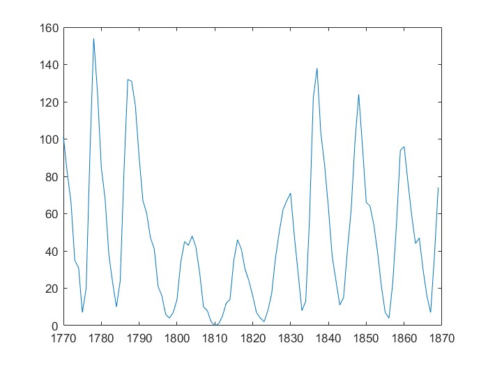
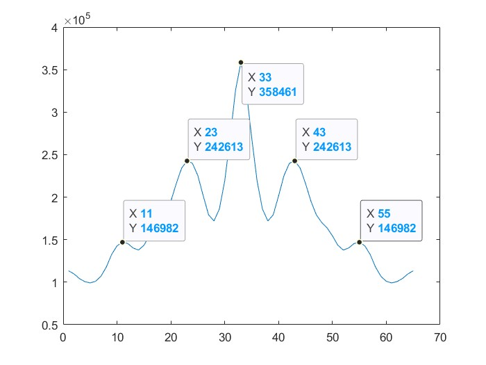
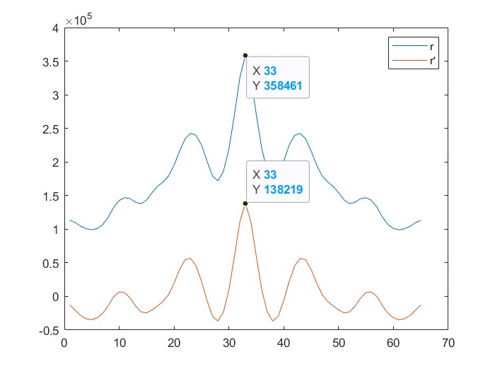

# 数字信号处理B

**PB21511897	李霄奕**

## HW1

### Exercise 1

$$
x(nT_s)=e^{-nT_s},\quad n=0,1,...\\
\begin{align*}
    r_x(mT_s)&=\sum\limits_{n=0}^\infty x(nT_s)x((n+m)T_s)\\
&=\sum\limits_{n=0}^\infty e^{-(2n+m)T_s}\\
&=e^{mT_s}\sum\limits_{n=0}^\infty e^{-2nT_s}\\
&=\dfrac{e^{mT_s}}{1-e^{-2T_s}}\\
\end{align*}
$$

### Exercise 2

#### 性质1

$$
\begin{align*}
    r_x(-m)&=\sum\limits_{n=-\infty}^{\infty} x(n)x(n-m)\\
&=\sum\limits_{n=-\infty}^{\infty} x(n+m)x(n)\\
&=\sum\limits_{n=-\infty}^{\infty} x(n)x(n+m)\\
&=r_x(m)\\
\end{align*}
$$

#### 性质2

$$
\begin{align*}
    r_x^*(-m)&=\left(\sum\limits_{n=-\infty}^{\infty}x^*(n)x(n-m)\right)^*\\
    &=\sum\limits_{n=-\infty}^{\infty}x(n)x^*(n-m)\\
    &=\sum\limits_{n=-\infty}^{\infty}x(n+m)x^*(n)\\
    &=\sum\limits_{n=-\infty}^{\infty}x^*(n)x(n+m)\\
    &=r_x(m)
\end{align*}
$$
### Exercise 3
$$
x(n) = A_1\cos(2\pi f_1nT_s) + A_2\sin(2\pi f_2nT_s)\\
\begin{align*}
    r_x(m)&=\sum\limits_{<T>}[A_1\cos(2\pi f_1nT_s) + A_2\sin(2\pi f_2nT_s)]\cdot [A_1\cos(2\pi f_1(n+m)T_s) + A_2\sin(2\pi f_2(n+m)T_s)]\\
    &=\sum\limits_{<T>}A_1^2cos(2\pi f_1nT_s)\cos(2\pi f_1(n+m)T_s)+A_1A_2\cos(2\pi f_1nT_s)\sin(2\pi f_2(n+m)T_s)\\
    &\quad +A_1A_2\sin(2\pi f_2nT_s)\cos(2\pi f_1(n+m)T_s)+A_2^2\sin(2\pi f_2nT_s)\sin(2\pi f_2(n+m)T_s)\\
    &=\sum\limits_{<T>}\dfrac{A_1^2}{2}[\cos(2\pi f_1(2n+m)T_s)+\cos(2\pi f_1mT_s)]\\
    &\quad +\dfrac{A_1A_2}{2}[\sin(2\pi f_1(2n+m)T_s)-\sin(2\pi (f_1n-f_2n-f_2m)T_s)]\\
    &\quad +\dfrac{A_1A_2}{2}[\sin(2\pi( f_2n+f_1n+f_1m)T_s)+\sin(2\pi ( f_2n-f_1n-f_1m)T_s)]\\
    &\quad +\dfrac{A_2^2}{2}[\cos(2\pi f_2mT_s)-\cos(2\pi(f_1n+f_2n+f_2m)T_s)]\\
    &=\sum\limits_{<T>}\dfrac{A_1^2}{2}\cos(2\pi f_1mT_s)+\dfrac{A_2^2}{2}\cos(2\pi f_2mT_s)\\
    &=\dfrac{A_1^2}{2}\cos(2\pi f_1mT_s)+\dfrac{A_2^2}{2}\cos(2\pi f_2mT_s)\\
\end{align*}
$$

### Exercise 4

#### (1)
太阳黑子图像：

#### (2)

根据相关函数图可以得出，太阳黑子的周期为11年

#### (3)

蓝线为原相关函数，红线为新相关函数，可以看出：减去平均值，相关函数整体往下平移，但是形状不变

