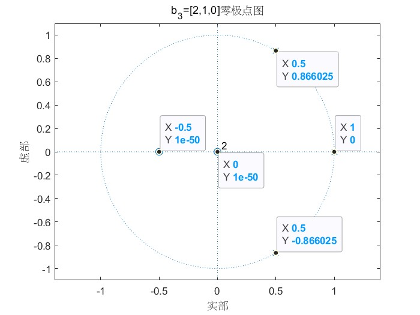

# 数字信号处理B

**PB21511897	李霄奕**

## HW2

### Exercise 1
$$
X(z)=\sum^{\infty}_{n=-\infty}x[n]z^{-n}\\
X(z)<\infty\text{：收敛域}\\
$$
#### (1)
$$
\begin{align*}
    X(z)&=\sum^{\infty}_{n=-\infty}x[n]z^{-n}\\
&=-\frac{1}{4}z^2-\frac{1}{2}z+1+\frac{1}{2}z^{-1}+\frac{1}{4}z^{-2}\\
\end{align*}\\
\quad\\
ROC:0<|z|<\infty
$$
#### (2)
$$
\begin{align*}
    X(z)&=\sum^{\infty}_{n=-\infty}x[n]z^{-n}\\
    &=\sum^{\infty}_{n=0}[\cos(\omega_0n)+\sin(\omega_0n)]\left(\dfrac{a}{z}\right)^{n}\\
    &=\sum^{\infty}_{n=0}[\dfrac{1-j}{2}\exp(j\omega_0)\dfrac{a}{z}]^n+[\dfrac{1+j}{2}\exp(-j\omega_0)\dfrac{a}{z}]^n\\
    &=\dfrac{1+(\sin\omega_0-\cos\omega_0)az^{-1}}{1-(2\cos\omega_0)az^{-1}+a^2z^{-2}}\\
\end{align*}\\
ROC=|z|>|a|
$$
#### (3)
$$
x[n]=\left(\frac{1}{4}\right)^nu[n]+\left(\frac{1}{2}\right)^{-n}u[-n-1]\\
\begin{align*}
    X(z)&=\dfrac{1}{1-\frac{1}{4}z^{-1}}-\dfrac{1}{1-2z^{-1}}\\
    &=\dfrac{-7z^{-1}}{4-7z^{-1}+2z^{-2}}\\
\end{align*}\\
ROC=|z|>\frac{1}{4}\bigcap|z|<2=\frac{1}{4}<|z|<2
$$
### Exercise 2
$$
k_1=0.8,k_2=-0.5,k_3=0.6\\
b_3^{(3)}=-k_3=-0.6,b_2^{(2)}=-k_2=0.5,b_1^{(1)}=-k_1=-0.8\\
由b_1^{(1)}=(b_2^{(1)}+k_2b_2^{(1)})/(1-k_2^2)\\
得b_2^{(1)}=-1.2\\
由b_2^{(1)}=(b_3^{(1)}+k_3b_3^{(2)})/(1-k_3^2)\\
且b_2^{(2)}=(b_3^{(2)}+k_3b_3^{(1)})/(1-k_3^2)\\
得\quad\begin{gather*}
    b_3^{(1)}=-1.5\\
    b_3^{(2)}=1.22\\
\end{gather*}\\
所以，转移函数为：\\
H(z)=1-1.5z^{-1}+1.22z^{-2}-0.6z^{-3}\\
差分方程为：\\
y[n]=x[n]-1.5x[n-1]+1.22x[n-2]-0.6x[n-3]\\
$$
### Exercise 3

代码部分如下：
```matlab
a=[1,-2,2,-1];
b=[0,2,1,0];
[z,p,k]=tf2zp(b,a);
zplane(b,a)
text(real(z)+0.1,imag(z),"零点")
text(real(p)+0.1,imag(p),"极点")
```

结果：

```matlab
零点：
z=[0,-0.5];
极点：
p=[1.0000 + 0.0000i,0.5000 + 0.8660i,0.5000 - 0.8660i];
增益：
k=2;
```


因此，系统零极点表达式为：
$$
H(z)=\dfrac{z(z+0.5)}{(z-1)(z-0.5+0.866j)(z-0.5-0.866j)}
$$


接下来替换不同的分子多项式向量，代码如下：

```matlab
a=[1,-2,2,-1];
b_1=[0,0,2,1,0];
b_2=[0,2,1,0];
b_3=[2,1,0];
zplane(b_1,a)
zplane(b_2,a)
zplane(b_3,a)
```

结果如下：



这三个向量造出的系统区别是$z=0$零点的个数不同，且向量越长越零点次数越少，因为：
$$
[0,0,2,1,0]\text{对应的分母多项式为：}z^4-2z^3+2z^2-z=z(z^3-2z^2+2z-1)\\
[0,2,1,0]\text{对应的分母多项式为：}z^3-2z^2+2z^1-1=1(z^3-2z^2+2z-1)\\
所以，系统多识别了一个极点z=0，抵消掉了零点\\
[2,1,0]\text{对应的分子多项式为：}2z^3+z^2=z(z^2+z^1)\\
[0,2,1,0]\text{对应的分子多项式为：}1(z^2+z^1)\\
所以，系统多识别了一个零点z=0，加强了零点\\
$$

### Exercise 4

$$
H(z)=\dfrac{z^2+2z+1}{z^3-0.5z^2-0.005z+0.3}
$$

##### 零极点图

代码如下：

```matlab
a=[1,-0.5,-0.005,0.3];
b=[0,1,2,1];
zplane(b,a)
b_1=[0,0,1,2,1];
b_2=[1,2,1];
b_3=[0,1,2,1];
zplane(b_1,a)
zplane(b_2,a)
zplane(b_3,a)
```

结果如下：


原因与Exercise 3完全相同，这里再做解释：
$$
[0,0,1,2,1]\text{对应的分母多项式为：}z^4-0.5z^3-0.005z^2+0.3z=z(z^3-0.5z^2-0.005z+0.3)\\
[0,1,2,1]\text{对应的分母多项式为：}z^3-0.5z^2-0.005z+0.3=1(z^3-0.5z^2-0.005z+0.3)\\
所以，系统多识别了一个极点z=0，抵消掉了零点\\
[1,2,1]\text{对应的分子多项式为：}z^3+2z^2+z=z(z^2+2z+1)\\
[0,1,2,1]\text{对应的分子多项式为：}1(z^2+2z+1)\\
所以，系统多识别了一个零点z=0，加强了零点\\
$$

##### 频率响应

```matlab
a=[1,-0.5,-0.005,0.3];
b=[0,1,2,1];
[h,w] = freqz(b,a,'whole',2001);
plot(w/pi,20*log10(abs(h)))
ylabel('幅度 (dB)')
xlabel('归一化频率 (\times\pi rad/采样点)')
zplane(b,a)
```


所有极点全部位于单位圆内，系统是稳定的

##### 冲激响应

```matlab
a=[1,-0.5,-0.005,0.3];
b=[0,1,2,1];
b_1=[0,0,1,2,1];
b_2=[1,2,1];
b_3=[0,1,2,1];
[h_1,t] = impz(b_1,a,30);
[h_2,t] = impz(b_2,a,30);
[h_3,t] = impz(b_3,a,30);
h=[h_1,h_2,h_3];
stem(t,h)
legend('b_1','b_2','b_3')
```


可以看到，这三种信号的冲激响应不同在于有了时延，原因正如前面分析，系统响应函数多乘或者多除了$z$相当于给系统整体提前或者延时了1时刻。

其中，b2的信号是合理的。
