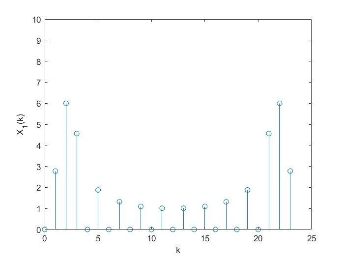

# 数字信号处理B

**PB21511897	李霄奕**

## HW4

### Exercise 1

$$
x(n)=\cos(n\pi/6),\quad n=0...12
$$

#### (1)

源代码：

```matlab
N_1=12;
N_2=1000;
step_1=1:N_1;
step_2=1:N_2;
n=step_1-1;
x=cos(n.*pi/6);
w=(step_2-1)./N_2.*2.*pi;
for step_1=1:N_1
    for step_2=1:N_2
        A(step_1,step_2)=x(step_1).*exp(-i.*w(step_2).*n(step_1));
    end
end
step_1=1:N_1;
step_2=1:N_2;
X(step_2)=sum(A(:,step_2));
subplot(2,1,1);
plot(w,abs(X));
xlim([0,2*pi]);
title('幅频');
xlabel('\omega');
ylabel('A(\omega)');
hold on;
subplot(2,1,2);
plot(w,angle(X));
xlim([0,2*pi]);
title('相频');
xlabel('\omega');
ylabel('\phi(\omega)');
hold off;
```

结果：


#### (2)

源代码：

```matlab
N_1=12;
step_1=1:N_1;
n=step_1-1;
x=cos(n.*pi/6);
X=fft(x);
stem(n,abs(X));
ylim([0,10]);
xlabel('k');
ylabel('X(k)');
```

结果：


#### (3)

源代码：

```matlab
N_1=12;
step_1=1:N_1;
n=step_1-1;
x=cos(n.*pi/6);
x_1=[x,zeros(1,N_1)];
X_1=fft(x_1);
stem([0:2*N_1-1],abs(X_1));
ylim([0,10]);
xlabel('k');
ylabel('X_1(k)');
```

结果：



结论：

对于DFT与DTFT之间的关系，DFT是对DTFT的采样。

对于正弦信号抽样，抽样序列后面补零，所取的点越密集，DFT与DTFT越接近。

### Exercise 2

#### (1)

源代码：

```matlab
x=[1,2,3,4];
h=[4,3,2,1];
y=conv(x,h);
```

结果：


#### (2)

源代码：

```matlab
x=[1,2,3,4];
h=[4,3,2,1];
x_1=[x,zeros(1,3)];%加零
h_1=[h,zeros(1,3)];%加零
y=cconv(x_1,h_1);%循环卷积函数
stem(y(1:7));%去掉末尾
ylim([0,40]);
```

结果：


#### (3)

思路：

两个序列循环卷积的DFT变换为相乘，所以可以用DFT和IDFT和乘法实现两个序列的循环卷积。

循环卷积涉及到信号时域两端的干扰，因此我们需要把信号补零至长度为$N_1+N_2-1$，进行循环卷积，然后取非零的部分，此时得到的信号与卷积是等效的

流程图如下：


### Exercise 3

#### (1)

源代码：

```matlab
f_0=50;
T_0=1./f_0;
f_s=100;
T_s=1./f_s;
N=16;
step_x=1:N;
n=step_x-1;
t=n.*T_s;
x=sin(2.*pi.*f_0.*t);
X=fft(x);
E_t=sum(x.*x);
E_f=2./N.*abs(X(1,(f_s./f_0)+1))^2;
efficiency=E_f/E_t;
subplot(2,1,1);
stem([0:length(x)-1],x);
ylim([-1,1]);
title('x(n)');
subplot(2,1,2);
stem([0:length(X)-1],abs(X));
ylim([0,10]);
title('X(k)');
```

结果：


$$
\eta=\dfrac{E_f}{E_t}=2.16\%
$$
理想情况应当是0%，但是由于计算机的精度问题存在一定误差

#### (2)

源代码：

```matlab
f_0=50;
T_0=1./f_0;
f_s=150;
T_s=1./f_s;
N=16;
step_x=1:N;
n=step_x-1;
t=n.*T_s;
x=sin(2.*pi.*f_0.*t);
X=fft(x);
E_t=sum(x.*x);
E_f=2./N.*abs(X(1,(f_s./f_0)+1))^2;
efficiency=E_f/E_t;
subplot(2,1,1);
stem([0:length(x)-1],x);
ylim([-1,1]);
title('x(n)');
subplot(2,1,2);
stem([0:length(X)-1],abs(X));
ylim([0,10]);
title('X(k)');
```

结果：


$$
\eta=\dfrac{E_f}{E_t}=0.50\%
$$
理想情况应当是0%，但是由于计算机的精度问题存在一定误差

#### (3)

源代码：

```matlab
f_0=50;
T_0=1./f_0;
f_s=200;
T_s=1./f_s;
N=16;
step_x=1:N;
n=step_x-1;
t=n.*T_s;
x=sin(2.*pi.*f_0.*t);
X=fft(x);
E_t=sum(x.*x);
E_f=2./N.*abs(X(1,(f_s./f_0)+1))^2;
efficiency=E_f/E_t;
subplot(2,1,1);
stem([0:length(x)-1],x);
ylim([-1,1]);
title('x(n)');
subplot(2,1,2);
stem([0:length(X)-1],abs(X));
ylim([0,10]);
title('X(k)');
```

结果：


$$
\eta=\dfrac{E_f}{E_t}=100\%
$$
对正弦信号抽样应当掌握的原则：抽样频率$f_s$和信号频率$f_0$应当满足$f_s\geqslant 2f_0$

### Exercise 4

源代码：

```matlab
f_0=50;
T_0=1./f_0;
f_s=200;
T_s=1./f_s;
N=16;
step_x=1:N;
n=step_x-1;
t=n.*T_s;
x=sin(2.*pi.*f_0.*t);
x_1=[x,zeros(1,N)];
X=fft(x);
X_1=fft(x_1);
E_t=sum(x.*x);
E_f=2./N.*abs(X(1,(f_s./f_0)+1))^2;
efficiency=E_f/E_t;
E_t_1=sum(x_1.*x_1);
E_f_1=2./N.*abs(X_1(1,((f_s./f_0)+1)*2))^2;
efficiency_1=E_f_1/E_t_1;
subplot(2,2,1);
stem(0:length(x)-1,x);
ylim([-1,1]);
title('x(n)');
subplot(2,2,3);
stem(0:length(X)-1,abs(X));
ylim([0,10]);
title('X(k)');
subplot(2,2,2);
stem(0:length(x_1)-1,x_1);
ylim([-1,1]);
xlim([0,32]);
title('x_1(n)');
subplot(2,2,4);
stem(0:length(X_1)-1,abs(X_1));
ylim([0,10]);
xlim([0,32]);
title('X_1(k)');
```

结果：


$$
\eta=\dfrac{E_f}{E_t}=100\%\\
\eta'=\dfrac{E_f'}{E_t'}=41.05\%
$$
正弦信号后面补零的影响有：

- DFT后的频谱不再是完美的$\delta$函数，存在调制的分量
- 频谱存在泄露，效率$\eta'=41.05\%$