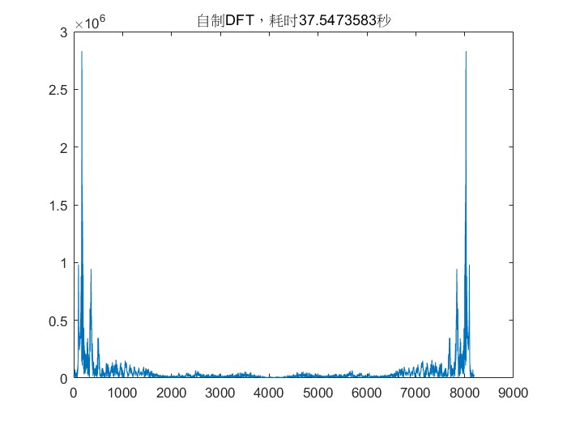

# 数字信号处理B

**PB21511897	李霄奕**

## HW5

### Exercise 1

自制fft函数：

```matlab
function y = MATLAB_ditfft(x)
    m=nextpow2(length(x));
    N=2^m;
    if length(x)<N
        x=[x,zeros(1,N-length(x))];
    end
    %nxd=bin2dec(fliplr(dec2bin([1:N]-1,m)))+1;
    nxd0=dec2bin([1:N]-1,m);
    nxd1=fliplr(nxd0);
    nxd=bin2dec(nxd1)+1;
    y=x(nxd);
    for mm=1:m
        Nmr=2^mm;
        u=1;
        WN=exp(-1i*2*pi/Nmr);
        for j=1:Nmr/2
            for k=j:Nmr:N
                kp=k+Nmr/2;
                t=y(kp)*u;
                y(kp)=y(k)-t;
                y(k)=y(k)+t;
            end
            u=u*WN;
        end
    end
end
```

自制完全未优化的DFT函数：

```matlab
function y=MATLAB_dft(x)
    N=length(x);
    x=x';
    A=zeros(N,N);
    W=exp(-1i*2*pi/N);
    for i=0:N-1
        for j=0:N-1
            A(i+1,j+1)=W^(i*j);
        end
    end
    y=A*x;
end

```

验证代码：

```matlab
[y0,fs]=audioread("bluesky1.wav");
y=y0(1:8192,1);
y=y';
y=y.*32768;
tic;
Y1=fft(y);
t1=toc
tic;
Y2=MATLAB_ditfft(y);
t2=toc
tic;
Y3=MATLAB_dft(y);
t3=toc

plot(abs(Y1));
title("内置FFT，耗时"+mat2str(t1)+"秒");
plot(abs(Y2));
title("自制FFT，耗时"+mat2str(t2)+"秒");
plot(abs(Y3));
title("自制DFT，耗时"+mat2str(t3)+"秒");
```

结果：




从运行耗费时间上来说，自制DFT>>自制FFT>内置FFT。

从输出结果来看，三幅图片完全相同，所以，DFT和FFT算法都是正确的。

### Exercise 2

由Nyquist采样定理，抽样频率$f_s$应当大于信号频率的2倍，所以
$$
f_s\geqslant 2f_h=4kHz\\
\Delta f\leqslant2Hz\\
T\geqslant1/\Delta f=0.5s\\
N\geqslant T\cdot f_s=2000\\
N_{min}=2^{11}=2048\\
T_{min}=N/f_s=0.512s
$$

### Exercise 3

$$
\begin{align*}
X(k)&=\sum_{n=0}^{23}x(n)W_{24}^{nk}\\
&=\sum_{n=0}^{7}x(3n)W_{24}^{3nk}+\sum_{n=0}^{7}x(3n+1)W_{24}^{3nk+k}+\sum_{n=0}^{7}x(3n+2)W_{24}^{3nk+2k}\\
&=\sum_{n=0}^{7}x(3n)W_{8}^{nk}+W_{24}^{k}\cdot\sum_{n=0}^{7}x(3n+1)W_{8}^{nk}+W_{12}^{k}\cdot\sum_{n=0}^{7}x(3n+2)W_{8}^{nk}\\
&=FFT_8(x(3n))+W_{24}^{k}\cdot FFT_8(x(3n+1))+W_{12}^{k}\cdot FFT_8(x(3n+2))\\
\end{align*}
$$

