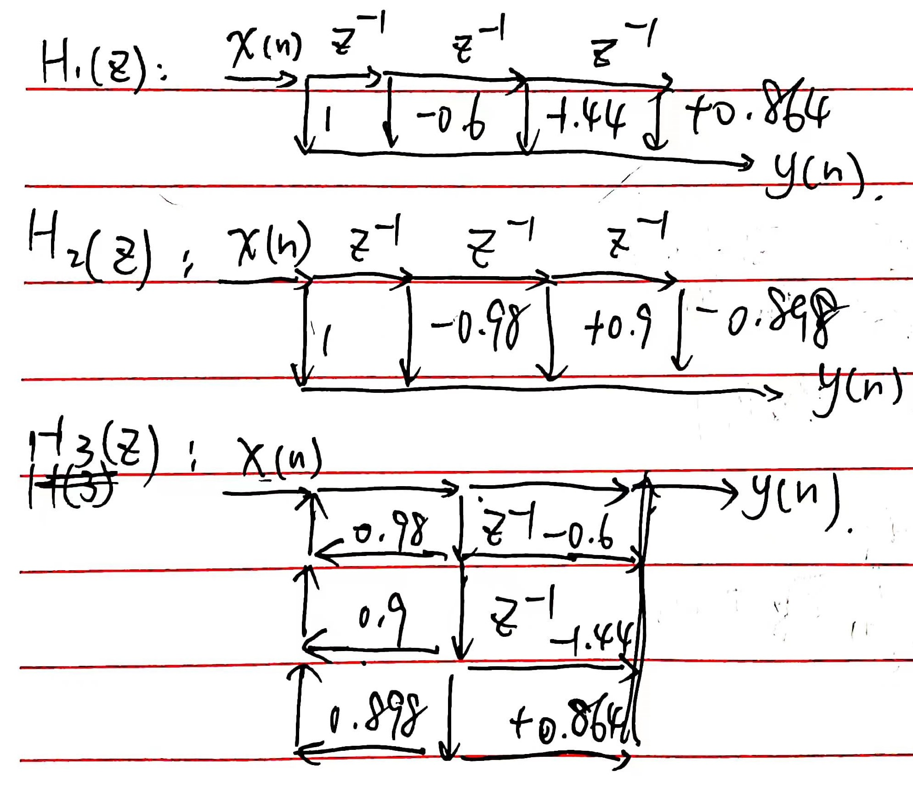

# 数字信号处理B

**PB21511897	李霄奕**

## HW7

### Exercise 1

#### (1)

$$
\begin{align*}
|H_1(\omega)|^2&=\dfrac{\frac{13}{9}-\frac{4}{3}\cos\omega}{\frac{10}{9}-\frac{2}{3}\cos\omega}\\
&=\dfrac{(1-\frac{2}{3}e^{j\omega})(1-\frac{2}{3}e^{-j\omega})}{(1-\frac{1}{3}e^{j\omega})(1-\frac{1}{3}e^{-j\omega})}\\
&=\dfrac{(1-\frac{2}{3}e^{-j\omega})}{(1-\frac{1}{3}e^{-j\omega})}\cdot\dfrac{(1-\frac{2}{3}e^{j\omega})}{(1-\frac{1}{3}e^{j\omega})}\\
&=H_1(\omega)\cdot H_1(-\omega)\\
\end{align*}\\
$$

$$
H_1(\omega)=\dfrac{(1-\frac{2}{3}e^{-j\omega})}{(1-\frac{1}{3}e^{-j\omega})}
$$

#### (2)

$$
\begin{align*}
|H_2(\omega)|^2&=\dfrac{4(1-\alpha^2)}{(1+\alpha^2)-2\alpha\cos\omega}\\
&=\dfrac{2(1+\alpha)2(1-\alpha)}{(1-\alpha e^{j\omega/2})(1-\alpha e^{-j\omega/2})}\\
&=\dfrac{2(1-\alpha)}{(1-\alpha e^{-j\omega/2})}\cdot\dfrac{2(1+\alpha)}{(1-\alpha e^{j\omega/2})}\\
\end{align*}\\
$$

$$
H_2(\omega)=\dfrac{2(1-\alpha)}{(1-\alpha e^{-j\omega/2})}
$$

### Exercise 2

#### (1)

#### (2)

