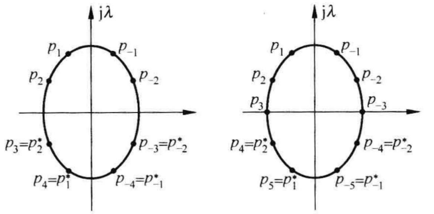

# 数字信号处理B

**PB21511897	李霄奕**

## HW8

### Exercise 1

切比雪夫I型模拟滤波器公式：
$$
|G(j\Omega)|^2=\dfrac{1}{1+\varepsilon^2C_n^2(\Omega)}=\dfrac{1}{1+\varepsilon^2\cos^2(n\cos^{-1}\Omega)}
$$
令分母等于0，$\cos^{-1}\Omega=\varphi$，可以求得极点
$$
\begin{align*}
1+\varepsilon^2\cos^2(n\varphi)&=0\\
\cos^2(n\varphi)&=-\dfrac{1}{\varepsilon^2}\\
\dfrac{\cos(2n\varphi)+1}{2}&=-\dfrac{1}{\varepsilon^2}\\
\cos(2n\varphi)&=\dfrac{-2-\varepsilon^2}{\varepsilon^2}\\

2in\varphi&=\cosh^{-1}\dfrac{-2-\varepsilon^2}{\varepsilon^2}\\
\varphi&=\dfrac{\cosh^{-1}\dfrac{-2-\varepsilon^2}{\varepsilon^2}}{2ni}\\
\Omega_p&=\cos(\dfrac{\cosh^{-1}\dfrac{-2-\varepsilon^2}{\varepsilon^2}}{2ni})
\end{align*}
$$
可以将（1）公式变化如下：
$$
p_k=-\sin(\dfrac{(2k-1)\pi}{2n})\sinh(\varphi_2)+j\cos(\dfrac{(2k-1)\pi}{2n})\cosh(\varphi_2)\\
\text{令 }\varphi_3=\dfrac{(2k-1)\pi}{2n}\\
p_k=-\sin(\varphi_3)\sinh(\varphi_2)+j\cos(\varphi_3)\cosh(\varphi_2)\\
\text{令 }\begin{cases}
\sigma_k=-\sin(\varphi_3)\sinh(\varphi_2)\\
\lambda_k=\cos(\varphi_3)\cosh(\varphi_2)\\
\end{cases}\\
\text{则满足：}\left(\dfrac{\sigma_k}{\sinh(\varphi_2)}\right)^2+\left(\dfrac{\lambda_k}{\cosh(\varphi_2)}\right)^2=1\\
\text{这表示极点在椭圆上均匀分布，且跟实轴、虚轴对称}
$$

### Exercise 2

$$
\omega_p=0.2\pi,\omega_s=0.6\pi\\
\Omega_p=\dfrac{\omega_p}{T_s}=200\pi,\Omega_s=\dfrac{\omega_s}{T_s}=600\pi\\
\lambda_p=\dfrac{\Omega_p}{\Omega_p}=1,\lambda_s=\dfrac{\Omega_s}{\Omega_p}=3\\
\alpha_p=3,\alpha_s=20\\
\varepsilon=\sqrt{10^{\alpha_p/10}-1}=1\\
a=\sqrt{\dfrac{10^{\alpha_s/10}-1}{10^{\alpha_p/10}-1}}=9.97\\
n=\dfrac{\cosh^{-1}a}{\cosh^{-1}\lambda_s}=1.70,N=2\\
G(p)=\dfrac{1}{p^2+\sqrt2p+1}\\
G(s)=G(p=\dfrac{s}{\Omega_p})=\sqrt2\Omega_p\cdot\dfrac{\left(\dfrac{\Omega_p}{\sqrt2}\right)^2}{\left[s-(-\dfrac{\Omega_p}{\sqrt2})\right]^2+\left(\dfrac{\Omega_p}{\sqrt2}\right)^2}=\sqrt2\Omega_p\cdot\dfrac{\beta^2}{\left(s-\alpha\right)^2+\beta^2}\\
\alpha=-\dfrac{\Omega_p}{\sqrt2},\beta=\dfrac{\Omega_p}{\sqrt2}\\
H(z)=\sqrt2\Omega_p\cdot\dfrac{zT_se^{\alpha T_s}\sin(\beta T_s)}{z^2-z2e^{\alpha T_s}\cos(\beta T_s)+e^{2\alpha T_s}}\\
H(z)=\dfrac{0.2449z^{-1}}{1-1.1580z^{-1}+0.4112z^{-2}}
$$

