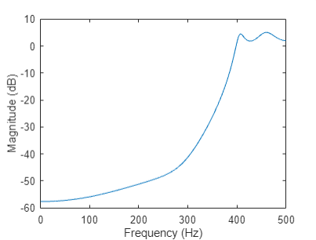
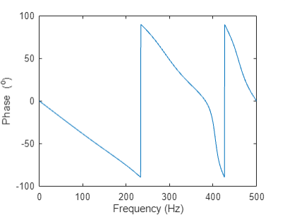

# 数字信号处理B

**PB21511897	李霄奕**

## HW9

### Exercise 1

$$
\omega_p=0.2\pi,\omega_s=0.5\pi,T_s=10\mu s=1\times10^{-5}s\\
\Omega_p=\dfrac{\omega_p}{T_s}=2\times10^4\pi,\Omega_s=\dfrac{\omega_s}{T_s}=5\times10^4\pi\\
\lambda_p=\dfrac{\Omega_p}{\Omega_p}=1,\lambda_s=\dfrac{\Omega_s}{\Omega_p}=2.5\\
\alpha_p=3,\alpha_s=30\\
C=\sqrt{10^{\alpha_p/10}-1}=1\\
a=\sqrt{\dfrac{10^{\alpha_s/10}-1}{10^{\alpha_p/10}-1}}=31.68\\
n=\dfrac{\lg a}{\lg \lambda_s}=3.77,N=4\\
p_k=\exp\left(j\dfrac{2k+N-1}{2N}\pi\right),k=1...N\\
G(p)=\dfrac{1}{(p-p_1)(p-p_2)(p-p_3)(p-p_4)}=\dfrac{1}{(p^2-2p\cos\frac{5}{8}\pi+1)(p^2-2p\cos\frac{7}{8}\pi+1)}\\
G(s)=G(p=\frac{s}{\Omega_p})=\dfrac{1}{(1-\cos^2\frac{5}{8}\pi)(1-\cos^2\frac{7}{8}\pi)}\cdot\dfrac{(1-\cos^2\frac{5}{8}\pi)}{(p-\cos\frac{5}{8}\pi)^2+(1-\cos^2\frac{5}{8}\pi)}\cdot\dfrac{(1-\cos^2\frac{7}{8}\pi)}{(p-\cos\frac{7}{8}\pi)^2+(1-\cos^2\frac{7}{8}\pi)}\\
G(s)=A\dfrac{\beta_1^2}{\left(s-\alpha_1\right)^2+\beta_1^2}\cdot\dfrac{\beta_2^2}{\left(s-\alpha_2\right)^2+\beta_2^2}\\
A=\dfrac{1}{(1-\cos^2\frac{5}{8}\pi)(1-\cos^2\frac{7}{8}\pi)},\alpha_1=\cos\frac{5}{8}\pi,\alpha_2=\cos\frac{7}{8}\pi,\beta_1=\sqrt{1-\cos^2\frac{5}{8}\pi},\beta_2=\sqrt{1-\cos^2\frac{7}{8}\pi}\\
H(z)=A\cdot\dfrac{zT_se^{\alpha_1 T_s}\sin(\beta_1 T_s)}{z^2-z2e^{\alpha_1 T_s}\cos(\beta_1 T_s)+e^{2\alpha_1 T_s}}\cdot\dfrac{zT_se^{\alpha_2 T_s}\sin(\beta_2 T_s)}{z^2-z2e^{\alpha_2 T_s}\cos(\beta_2 T_s)+e^{2\alpha_2 T_s}}\\
H(z)=\dfrac{0.0169z^{-1}+0.0442z^{-2}+0.075z^{-3}}{1-2.402z^{-1}+2.3608z^{-2}-1.0839z^{-3}+0.1936z^{-4}}
$$

### Exercise 2

$$
f_p=400Hz,f_s=300Hz,F_s=1000Hz,\alpha_p=3,\alpha_s=35\\
\omega_p=2\pi\dfrac{f_p}{F_s}=0.8\pi,\omega_s=2\pi\dfrac{f_s}{F_s}=0.6\pi\\
\Omega_p=\tan(\dfrac{\omega_p}{2})=3.0777,\Omega_s=\tan(\dfrac{\omega_s}{2})=1.3764\\
\eta_p=\dfrac{\Omega_p}{\Omega_p}=1,\eta_s=\dfrac{\Omega_s}{\Omega_p}=0.4472\\
\lambda_p=\dfrac{1}{\eta_p}=1,\lambda_s=\dfrac{1}{\eta_s}=2.23605\\
\varepsilon=\sqrt{10^{\alpha_p/10}-1}=1\\
a=\sqrt{\dfrac{10^{\alpha_s/10}-1}{10^{\alpha_p/10}-1}}=56.36\\
n=\dfrac{\cosh^{-1}a}{\cosh^{-1}\lambda_s}=4\\
G(p)=\dfrac{1}{8(p^2+0.17p+0.9029)(p^2+0.4104p+0.1958)}\\
H(z)=G(p=\dfrac{\Omega_p}{s},s=\dfrac{z+1}{z-1})\\
H(z)=\dfrac{0.00105(1-4z^{-1}+6z^{-2}-4z^{-3}+z^{-4})}{1+3.270z^{-1}+4.342z^{-2}+2.743z^{-3}+0.695z^{-4}}
$$

幅频响应：

相频响应：

### Exercise 3

$$
f_{pl}=44Hz,f_{sl}=47Hz,f_{sh}=53Hz,f_{ph}=56Hz\\
\omega=2\pi\frac{f}{F_s}\\
\omega_{pl}=0.27646,\omega_{sl}=0.29531,\omega_{sh}=0.33301,\omega_{ph}=0.35186\\
\Omega=\tan\dfrac{\omega}{2}\\
\Omega_{pl}=0.139117,\Omega_{sl}=0.148737,\Omega_{sh}=0.168060,\Omega_{ph}=0.177767\\
\Omega_{BW}=\Omega_{ph}-\Omega_{pl}=0.0386497,\Omega_0=\sqrt{\Omega_{ph}\Omega_{pl}}=0.157259\\
\eta=\Omega/\Omega_{BW}\\
\eta_{pl}=3.599436,\eta_{sl}=3.848340,\eta_{sh}=4.348293,\eta_{ph}=4.599436\\
\lambda_p=1,\lambda_s=1.84855\\
p=\dfrac{z^2-1}{26.5133z^2-50.4671z+26.5133}\\
H(z)=\dfrac{1-11.11z^{-1}-180.12z^{-2}-595.81z^{-3}+675.93z^{-4}-568.80z^{-5}-156.77z^{-6}-8.83z^{-7}+0.76z^{-8}}{0.61-6.95z^{-1}-118.63z^{-2}-412.34z^{-3}+478.96z^{-4}-412.34z^{-5}-118.63z^{-6}-6.95z^{-7}+0.61z^{-8}}
$$

