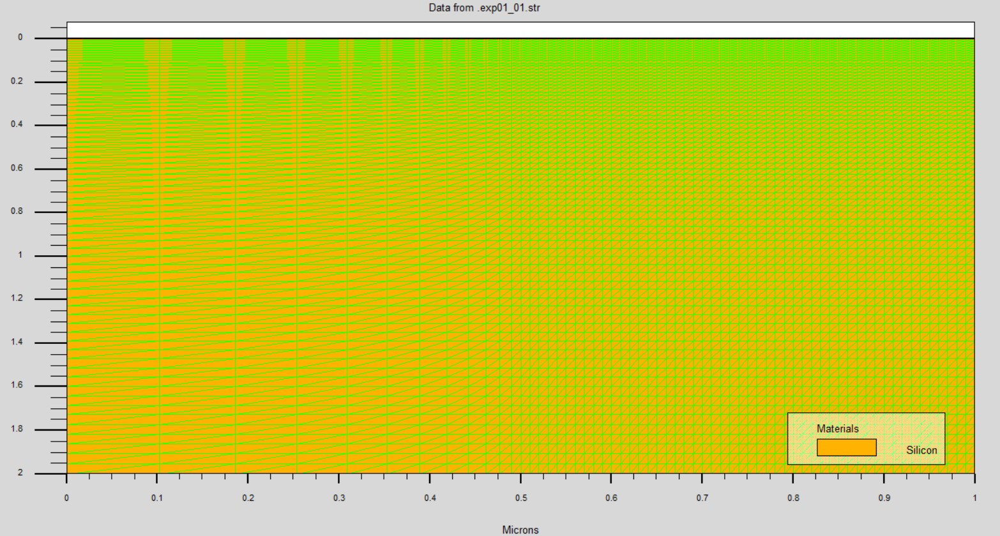
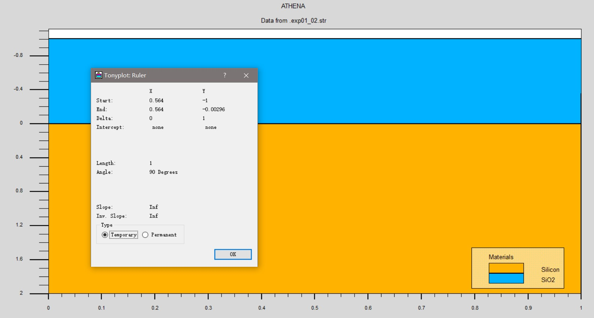
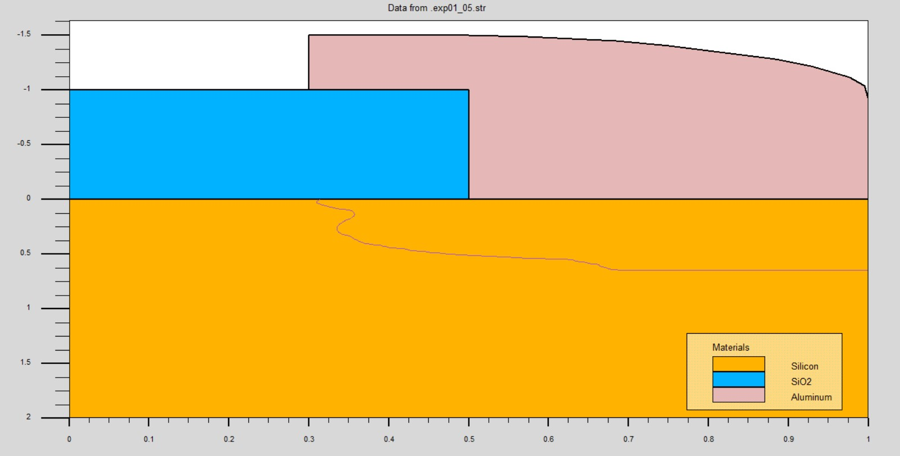
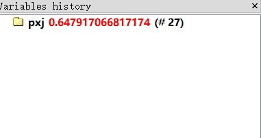
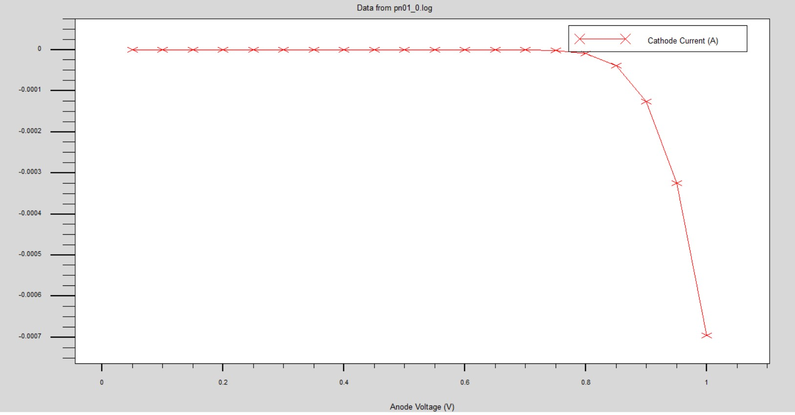
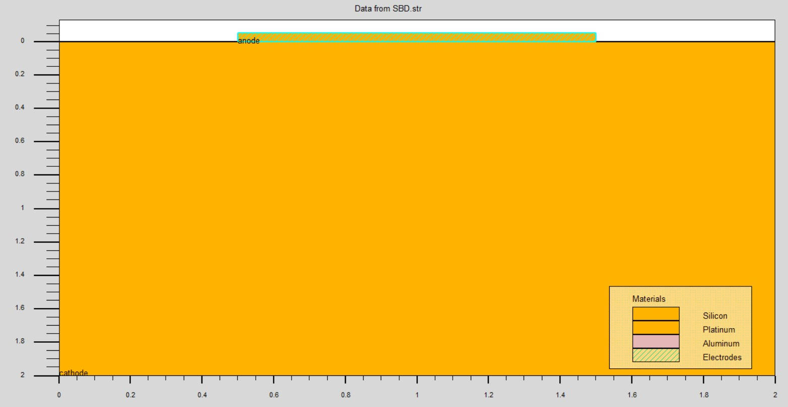
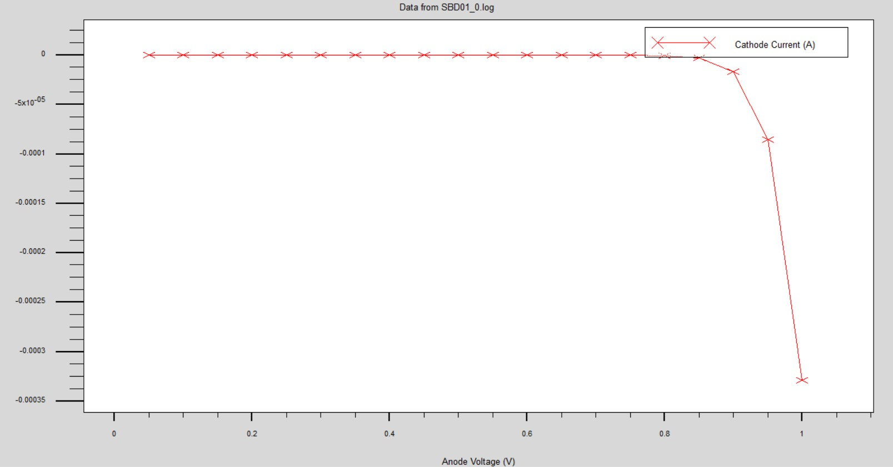
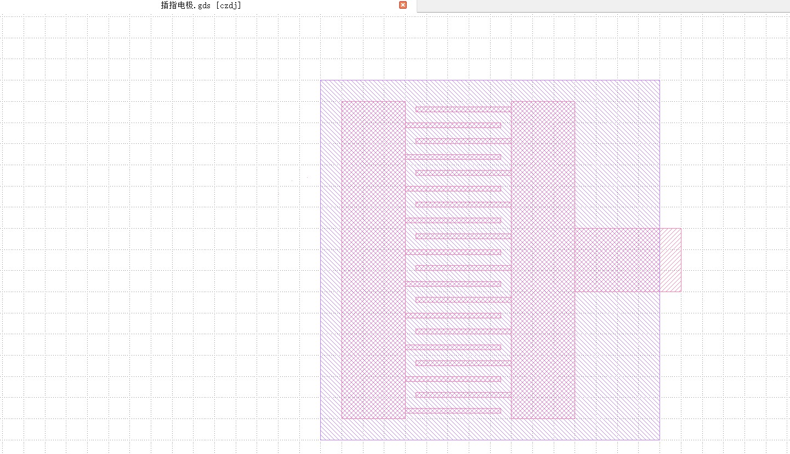

# 微电子专业基础实验作业

PB21511897	李霄奕

## 工艺部分

### 实验1

#### 作业1

题目：图 9 中的网格何处密？何处疏？两处在器件模拟时不同在哪？

答案：

可以看出，网格左下稀疏，右上密集，两处在器件模拟时不同的地方在于，网格越密集，模拟的单元越小越密集，模拟的结果越准确，但是也越慢

#### 作业2

题目：请测量一下图 12 中淀积氧化层的厚度是多少？

答案：

运用尺子工具和目测，$\Delta Y=1$，所以，氧化层$SiO_2$的厚度为$1\mu m$

#### 作业3

题目：请给出金属淀积后和刻蚀后的器件结构图。

答案：如图所示

#### 作业4

题目：X=0.8µm 处的结深是多少？

答案：$pxj=0.6479\mu m$

#### 作业5

题目：给出你自己编程绘出的 pn 结 I-V 特性图。

答案：如图所示

### 实验2

#### 作业1

题目：请描述所仿真的器件结构（如掺杂浓度，厚度）。

答案：该器件从下往上一共有2层材料

- 硅，(100)晶面，磷掺杂的浓度为$1.0\times 10^{18}cm^{-3}$
- 铂，厚度为$0.05\mu m$

#### 作业2

题目：请给出所设计器件的:纵向结构图，I-V 特性图。

答案：如图所示

#### 作业3

题目：请给出所设计器件的横向结构图（即版图）

答案：

该器件为一个两层的插指电极