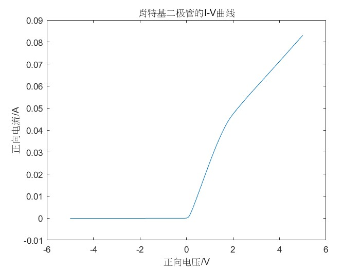
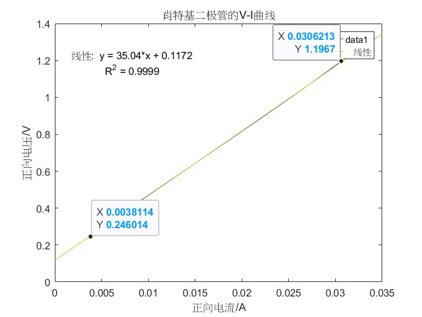
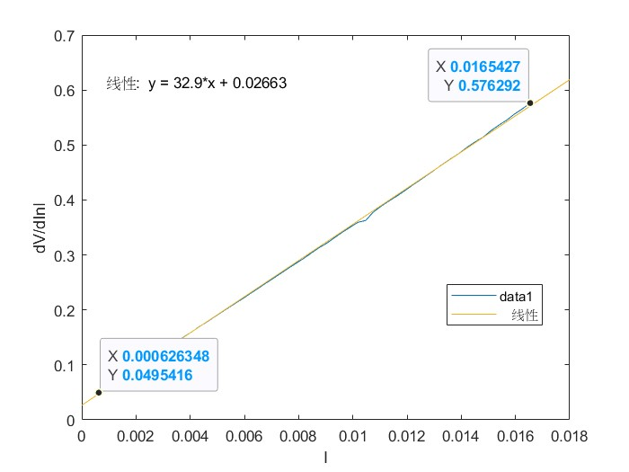

# 微电子专业基础实验作业

PB21511897	李霄奕

## 器件部分

### 实验1

肖特基二极管参数提取

#### I-V曲线

得出来的I-V曲线如下：

#### 整流比

$$
\text{整流比}=\dfrac{J_{@2V}}{J_{S@-2V}}=\dfrac{47.2mA}{-5.79\times 10^{-5}A}=-815.3
$$

#### 开启电压

开启电压为0.075V

#### 开启电阻

线性部分截取如下：

所以开启电阻$R_{on}=35.04\Omega$

#### 正向电流密度、饱和电流密度

由芯片版图可知，横截面积为$350\mu m\times 350\mu m$
$$
I_{@2V}=47.2mA\\
I_{S@-2V}=-5.79\times 10^{-5}A\\
J_{@2V}=134.86A\cdot m^{-2}\\
J_{@-2V}=-0.17A\cdot m^{-2}\\
$$

#### 理想因子

对$\dfrac{dV}{dlnI}$和$I$作图：

由直线截距可知：
$$
nV_T=26.63mV\\
n=\dfrac{26.63mV}{26mV}=1.02
$$

#### 串联电阻

由上图，直线斜率即为串联电阻
$$
R_s=32.9\Omega
$$

#### 势垒高度

$$
\phi_B=-V_T\ln(\dfrac{J_s}{RT^2})=-0.7V
$$

