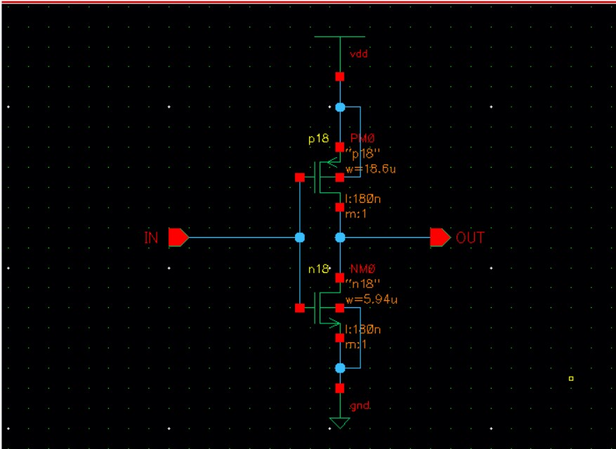

# 微电子专业基础实验作业

PB21511897	李霄奕

## 模拟部分

### 实验2

#### 1

标有 MOS 尺寸的 inv4x 电路图，以及 VM 仿真图:

 inv4x 电路图:

VM仿真图：

#### 2

 填表 2.3；

| 反相器链 INVchain 模块中单元 | Inv1x | Inv2x  | Inv3x | Inv4x  |
| ---------------------------- | ----- | ------ | ----- | ------ |
| 输出信号（线网名）           | inv1  | inv2   | inv3  | inv4   |
| Tr=20~80%上升时间(ps)        | 42.39 | 56.87  | 58.97 | 74.87  |
| Tf=80~20%下降时间(ps)        | 51.31 | 76.00  | 65.72 | 84.62  |
| 边沿速率=(Tr +Tf)/2(ps)      | --    | --     | --    | 79.745 |
| 50%处路径（传播）延时(ps)    | --    | 104.45 | --    | 254.60 |

#### 3

INVchain-2（电路方案五）单元的电路图：

瞬态仿真波形：

应如何减小 clock skew？

为减小 clock skew，应尽量使时钟树负载平衡，从具体操作上来说，应当对负载电容较小的支路上并联电容，使得负载均衡。

#### 4

myDFF 单元的电路图：

正确时序的瞬态仿真波形：

D 输入与 CK 时钟触发时间有何要求？

D的输入和CK时钟的跳变应当尽量错开，避免CK的上升沿和D输入的跳变同步进行，从而使得时序逻辑出现不稳定的情况。

#### 5

对于完成的选做实验，要有电路图和仿真波形贴图。

##### 电路方案一：2 级反相器链 INVchain2-1

电路图：

仿真结果：

INVchain2-1 的峰值电流：1.9032mA

##### 电路方案二：2 级反相器链 INVchain2-2

电路图：

仿真结果：

峰值电流：2.7408mA

##### 电路方案三：2 级反相器链 INVchain2-3

##### 电路方案四：2 级反相器链 INVchain2-4

电路图：

仿真结果：

INVchain2-4最大瞬态电流：1.4551mA

INVchain最大瞬态电流：3.741mA

INVchain2-4平均电流：431.7e-6

INVchain平均电流：630.7e-6

INVchain2-4 与 INVchain 最大瞬态电流之比：0.38896

INVchain2-4 与 INVchain 平均电流（功耗）之比：0.68448
