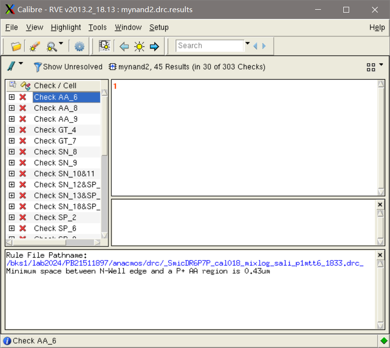

# 微电子专业基础实验作业

PB21511897	李霄奕

## 模拟部分

### 实验4

#### 1

给出初始和最终版图设计的截屏；电路版图面积是多少？

初始设计

最终设计

$$
7.68\mu m\times7.59\mu m=58.29\mu m^2
$$

#### 2

将第一次 DRC后的 Calibre RVE 窗口和修改违例后(可以有违例未消除) 的 Calibre RVE 截屏

修改前：

修改后：

#### 3

给出 LVS 物理验证报告结果的截屏

