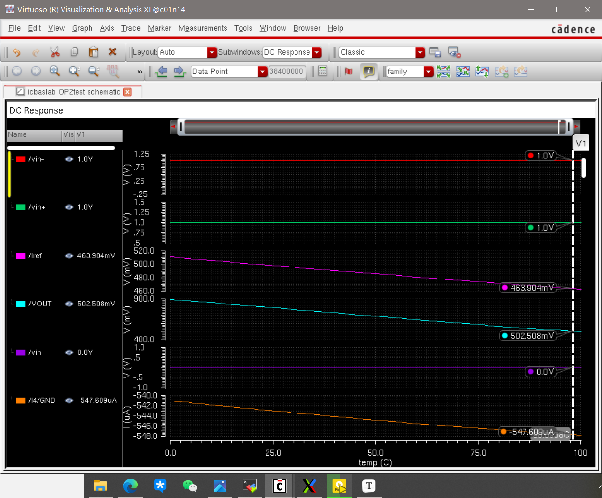

# 微电子专业基础实验作业

PB21511897	李霄奕

## 模拟部分

### 实验5

#### 原理图

#### 测试平台原理图

#### 功耗

目标：<1mW

结果：最大功耗=1.8V*247.609uA=0.44mW<1mW

#### 直流工作点

#### 瞬态仿真波形

放大波形正常，没有失真

#### 低频增益

低频增益为：
$$
A_V=\dfrac{4580.97kV}{1V}=4580970=133.22dB>90dB
$$
#### 单位增益

单位增益频率为81.48MHz>80MHz

#### 相位裕度

目标：60°

结果：

#### 共模输出范围

共模输入1.3V波形：

共模输入0.7V波形：

